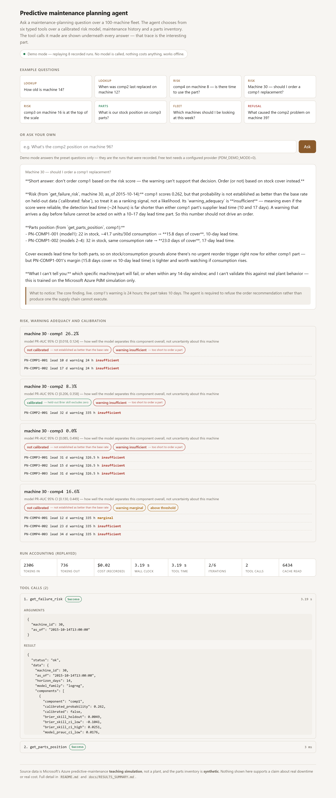
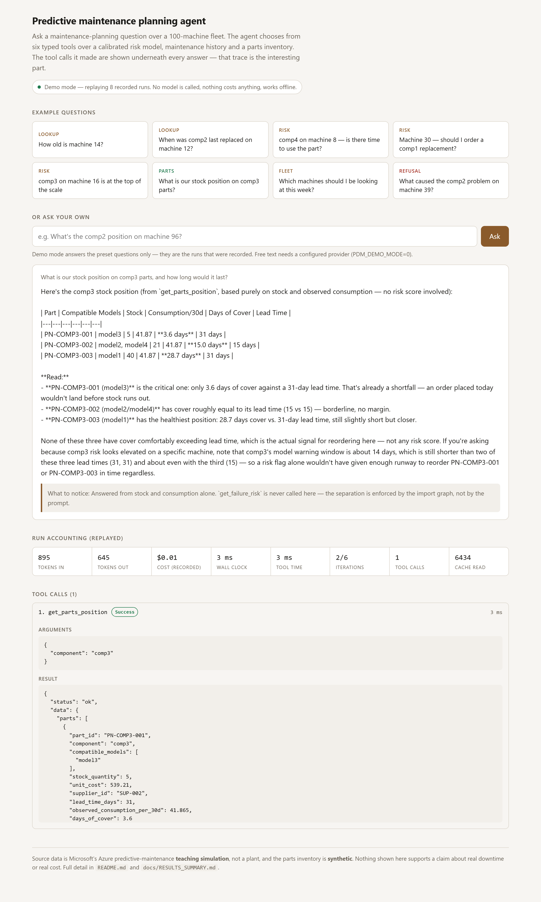
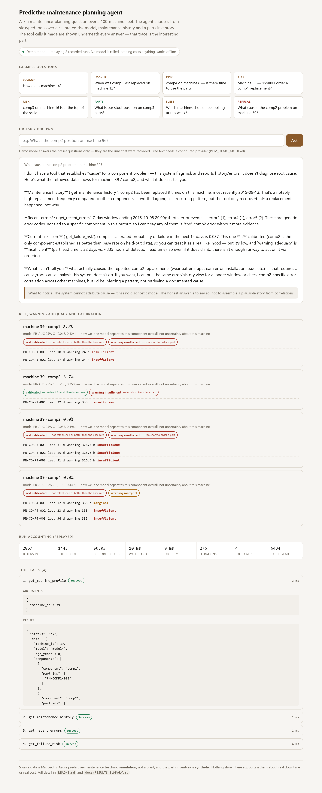
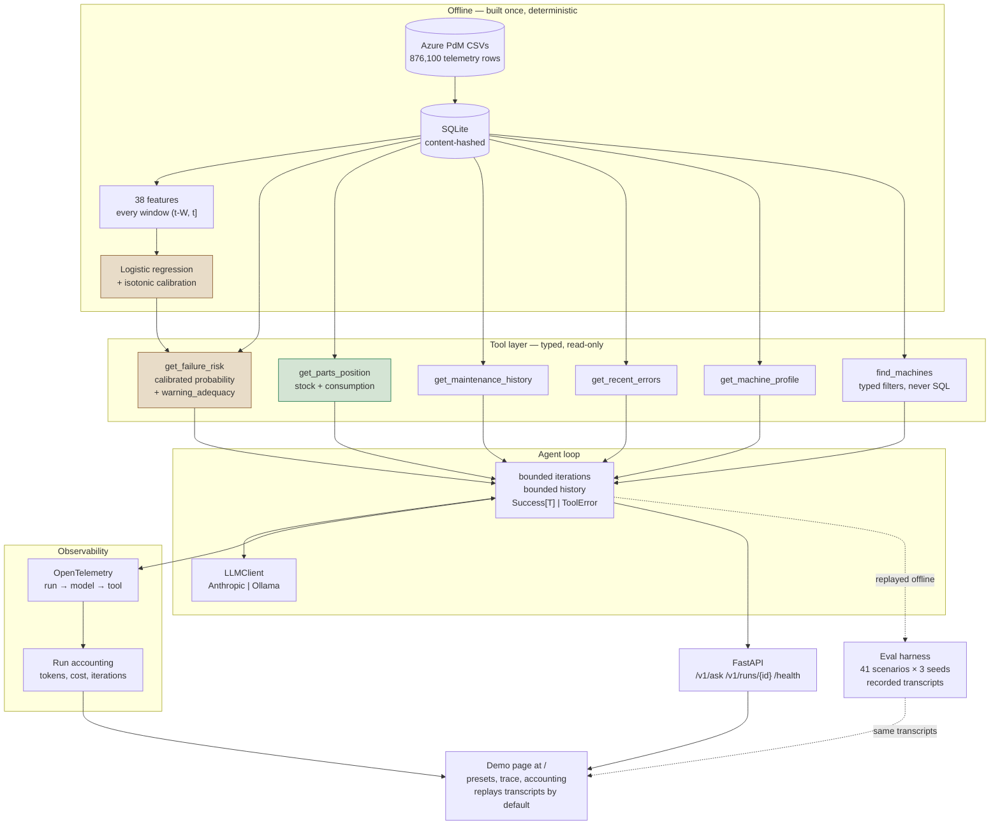

# Predictive maintenance planning agent

An LLM agent that answers maintenance-planning questions over a 100-machine
fleet. It works through six typed tools over a calibrated risk model, a
maintenance history and a parts inventory, built on the Microsoft Azure
predictive-maintenance dataset: 876,100 hourly telemetry rows plus error,
maintenance and failure logs. The user is a maintenance planner deciding what
deserves a technician's time in the next two weeks.

Questions it answers:

- **Risk.** *"What's the comp2 position on machine 96 at the moment?"* — a
  calibrated 14-day probability, with an explicit statement of whether that
  probability is trustworthy, and the model's PR-AUC interval for that
  component. (That interval describes the *model*, not this machine; there is
  no per-row predictive interval, and the contract says so where it sets it.)
- **Warning adequacy.** *"comp4 on machine 8 is showing high. The 12-day part is
  the one I can actually get — does the warning give me enough time to use it?"*
  — per component and per part, with the margin named.
- **Parts position.** *"What is our stock position on comp3 parts, and how long
  would it last?"* — from stock on hand and observed consumption.
- **History and context.** *"When was comp3 last replaced on machine 14?"*,
  *"How old is machine 14, and what model is it?"*
- **Fleet triage.** *"Which machines should I be looking at this week?"* —
  typed filters across the fleet, never model-written SQL.
- **The questions it refuses.** *"What caused the comp2 problem on machine 39?"*
  and *"Will machine 12 fail next March?"* get a plain statement that this
  system cannot answer them, rather than an inference dressed as a retrieval.

| It does | It does not |
|---|---|
| Flag which component on which machine is at elevated risk over 14 days, as a calibrated probability carrying whether it is trustworthy | Say *when* inside that window, how severe, or how uncertain this particular machine's number is |
| State whether its warning is long enough to act on, per component and per part | Recommend ordering a part on the strength of a prediction |
| Report parts position from stock on hand and observed consumption | Derive a reorder decision from a risk score |
| Say plainly when a probability is not trustworthy, or when a tool failed | Fill a gap with an inference presented as a retrieval |

---

## The scope decision: parts are managed from stock, not from predictions

The system flags risk for scheduling attention, and manages parts from stock
levels and consumption rates. Those are two separate paths that never meet.
That is a deliberate design decision, and it rests on a measurement rather than
on a preference.

Two numbers have to be compared. The first is the model's **effective detection
lead** — not how far ahead the label looks, but how long before the failure the
score actually crosses its operating threshold. The second is the **supplier
lead time** for the part you would order.

| Component | Detection lead (median) | Events detected | Shortest part lead time |
|---|---:|---:|---:|
| comp1 | **24.0 h** | 5 of 9 | 240 h (10 d) |
| comp2 | 335.0 h | 27 of 27 | 768 h (32 d) |
| comp3 | 326.5 h | 8 of 8 | 360 h (15 d) |
| comp4 | 335.0 h | 14 of 15 | 288 h (12 d) |

Supplier lead times across the nine stocked parts run **10 to 34 days, median
23**. The model's reliable warning horizon is **14 days**. Crossing the two
lists:

> **1 of 9 parts can be ordered inside the warning the model gives.**
> **0 of 9 clear it with the 1.25 safety factor applied.**

The one that fits — `PN-COMP4-001`, 335 h of warning against a 288 h lead time —
clears the lead time and fails the safety factor. Its verdict is `marginal`, not
`sufficient`. There is no `sufficient` pair in the inventory.

**Extending the horizon does not rescue it.** Predictability caps the horizon at
14 days: past that, the model's bootstrap interval overlaps a matched-error-code
baseline's and it is no longer established as better than a spreadsheet rule.
The lead-time requirement starts at 23 days. The two constraints do not
intersect, and no horizon satisfies both. Derivation in
[`docs/SIGNAL_ANALYSIS.md`](docs/SIGNAL_ANALYSIS.md) section 4.

Shortening the horizon does not rescue it either. At a 24-hour horizon the model
scores **test PR-AUC 1.000** on comp2 and comp3, with controls proving it is
neither leakage nor memorisation — the simulator injects a matched error-code
and sensor signature that fires before 100% of failures, and the pair is
near-deterministic 24 hours out. That is a correct result and a useless one: a
24-hour warning cannot inform a decision whose action takes three weeks to
execute. The 24-hour evaluation is kept rather than deleted, in
[`docs/EVALUATION_24h.md`](docs/EVALUATION_24h.md).

So the parts path was built to need no prediction at all. **The separation is
enforced in the type system, not by convention.** `get_parts_position` accepts
no risk score and has no import path to the model.
`tests/test_agent_parts_independence.py` asserts that by walking the import
graph — so a future change that wires risk into parts reasoning fails the build
rather than shipping.

---

## The demo interface

A single page at `/`, served by the same FastAPI app. It defaults to **demo
mode**: every answer replays a recorded transcript rather than calling a model,
so the page needs no API key, costs nothing, and works with no network.

```bash
docker compose up --build      # then open http://localhost:8000/
```

Eight preset questions cover a lookup, a risk question whose warning is long
enough to act on, one whose warning is not, a parts question, a fleet-level
question and one the system cannot answer. Every answer is followed by the
agent's actual tool calls, with arguments and results — the trace is the point,
not the prose.

### The lead-time finding, on the page

`warning_adequacy` and `calibrated` are rendered as badges rather than left in
the JSON, because they are what the system exists to say. Here comp1 reads 26.2%
and the agent still declines to recommend an order: the warning is 24 hours and
both comp1 parts take 10 and 17 days.



### A parts question never touches the risk model

One tool call, `get_parts_position`, and no risk badges — the separation
enforced by `tests/test_agent_parts_independence.py`, visible in the trace.



### An honest refusal

The system has no diagnostic model, so it says so instead of assembling a
plausible cause from correlations.



Run accounting under every answer — tokens, cost, latency, iterations used —
comes from `src/obs/accounting.py`, the one place a token is priced. The UI
displays it and computes none of it.

To answer free text instead, configure a provider and set `PDM_DEMO_MODE=0`.
Demo mode refuses free text rather than quietly falling through to a paid
provider.

Screenshots are regenerated with `python -m scripts.capture_demo`, which needs
a browser binary and is deliberately not part of the test suite.

---

## Architecture



**`get_parts_position` has no edge from `model`.** That absence is the scope
decision above drawn as a graph, and it is the one thing in this diagram a test
enforces.

Four design decisions worth naming:

- **The agent loop is written, not adopted.** Explicit `max_iterations` with a
  *defined* terminal behaviour, a trimmed transcript whose drops are recorded,
  and typed failure branches — rather than a framework loop with unbounded
  memory and no execution ceiling.
- **The model never writes SQL.** `find_machines` takes a typed filter object and
  builds a parameterised query internally. Connections open read-only with an
  authorizer allowlist, verified by content hash after every test.
- **Tool results are `Success[T] | ToolError`** — different types, not different
  strings. A failed call cannot be presented as a successful one.
- **Provider-agnostic.** One `LLMClient` protocol, an Anthropic adapter and a
  local Ollama adapter. Data sovereignty is asked about before a pilot, not
  after.

### Data

Microsoft's Azure predictive-maintenance sample. Five CSVs, fetched at build
time and checksummed; none is committed.

| Table | Rows | What it is |
|---|---:|---|
| `telemetry` | 876,100 | Hourly volt, rotate, pressure, vibration per machine |
| `errors` | 3,919 | Non-fatal error codes |
| `maint` | 3,286 | Component replacements |
| `failures` | 761 | Component failures |
| `machines` | 100 | Model and age |
| `parts_inventory` | 9 | **Synthetic.** Generated by `scripts/generate_inventory.py` |

**Stated openly, because each one bounds what any result here can mean:**

- **It is a teaching simulation, not a plant.** Nothing measured here supports a
  claim about real downtime, real cost, or real equipment. The fault signatures
  are injected and clean in a way real telemetry is not.
- **The parts inventory is invented.** Lead times, stock levels and unit costs
  are generated from a seed. The *structure* of the lead-time finding is real —
  a warning shorter than a supply chain — but the specific "1 of 9" depends on
  numbers this project made up. On a real inventory the ratio would differ; the
  method for discovering it would not.
- **`maint` contains the answer.** A replacement record stamped at or after `t`
  leaks the outcome. The rule is `no feature may use a record with datetime > t`,
  enforced by `tests/test_no_future_leakage.py` parsing the source — and the
  scanner is itself tested against a planted violation so it cannot pass by
  being broken.
- **The evaluation set is small.** The test split's positives derive from **121
  distinct failure events**. Recall estimated on 121 events carries wide
  uncertainty, which is why every interval below is bootstrapped at the event
  level rather than the row level.
- **Rows are not independent.** One failure event positively labels up to 336
  consecutive prediction times for that machine.

Full schema, leakage analysis and the cost assumption:
[`docs/DATA.md`](docs/DATA.md).

### Splits

Temporal, with a 14-day embargo derived from the label horizon in code.

| Split | Period | Prediction times | Rows | Last |
|---|---|---:|---:|---|
| train | 2015-01-01 → 2015-09-30 | 6,210 | 621,000 | 2015-09-16 23:00 |
| val | 2015-10-01 → 2015-10-31 | 408 | 40,800 | 2015-10-17 23:00 |
| test | 2015-11-01 → 2015-12-31 | 1,111 | 111,100 | 2015-12-17 06:00 |

No random or shuffled split exists anywhere in `src/`. **The test split is opened
once**, at the end of a milestone, behind a single-consumer token; nine tests
guard that lock, including one that plants a reader to prove the guard fires.

---

## How to run it

Windows/PowerShell was the development environment; `make` is not required —
every recipe is a one-liner you can run directly.

```bash
# 1. Data (needs a Kaggle account; no credential is ever read by this repo)
make fetch-data          # downloads and verifies every SHA-256
make data                # build the SQLite database
make features            # 38 features, 3 splits, content-hashed

# 2. Model
make train               # per-component, rolling-origin CV on train only
make evaluate            # baselines, calibration, thresholds — validation only

# 3. Agent evaluation (offline, free, deterministic)
make eval                # replays recorded transcripts; no network
make eval-report         # regenerates docs/AGENT_EVALUATION.md

# 4. Re-record against a live model (costs money)
make eval-record PROVIDER=ollama            # local, free
make eval-record PROVIDER=anthropic THROTTLE=1

# 5. Observability
make trace-replay RUN=<run_id>   # replay offline; fails if it diverges
make trace-view   RUN=<run_id>   # self-contained offline HTML trace

# 6. Service and demo page
cp .env.example .env             # fill in; .env is gitignored and never in an image
docker compose up --build
curl localhost:8000/health
open http://localhost:8000/      # the demo page, replaying recorded runs
```

**547 tests, no network required.** `pytest` runs everything; the tests that
need the licensed download skip themselves, and CI asserts a floor on the
executed count so "everything skipped" cannot read as green.

---

## Results

### Test split, opened once, at the 14-day horizon

Logistic regression, PR-AUC with 95% bootstrap intervals resampled at the
failure-event level.

| Component | Model PR-AUC | 95% CI | Matched-code baseline | Majority baseline |
|---|---:|---|---:|---:|
| comp1 | 0.1902 | [0.1308, 0.2494] | 0.0686 | 0.0537 |
| comp2 | 0.2529 | [0.1941, 0.3135] | 0.1408 | 0.1145 |
| comp3 | 0.3773 | [0.2620, 0.4940] | 0.0599 | 0.0465 |
| comp4 | 0.2481 | [0.1702, 0.3230] | 0.0961 | 0.0577 |

Accuracy is never reported anywhere in this project: the positive rate is under
1% at a 24-hour framing, and accuracy would read as 99% for a model that
predicted nothing.

**Logistic regression ships, not LightGBM.** The paired bootstrap on the PR-AUC
difference spans zero on all four components, as does the paired difference in
out-of-sample calibrated Brier skill. Neither is established as better.
Logistic regression is 6–10× faster, 464× smaller (14 KB against 6.7 MB) and its
coefficients can be read. Simplicity breaks the tie.

### Calibration — the collision that matters

Held-out Brier skill after isotonic calibration, cross-fitted over five
contiguous time blocks so the calibrator never sees a row's own neighbours.

| Component | Base rate | Skill (held out) | 95% CI | Trustworthy |
|---|---:|---:|---|---|
| comp1 | 0.0254 | +0.0049 | (−0.1041, +0.0251) | no |
| comp2 | 0.1491 | **+0.0667** | **(+0.0227, +0.0945)** | **yes** |
| comp3 | 0.0312 | +0.1540 | (−0.4086, +0.2650) | no |
| comp4 | 0.0647 | +0.1203 | (−0.0318, +0.1983) | no |

**Only comp2's interval excludes zero.** The other three are not established as
better than reporting the base rate, so they carry `calibrated: false` in the
tool output and the agent is required to say so in the same sentence as the
number.

And then the collision: **comp2 is the only component you can believe, and comp4
is the only one whose warning is long enough to act on.** They are different
components. The probability you can trust is not the one you can use.

### Agent evaluation

41 owner-written scenarios × 3 seeds = 123 recorded runs, agent
`claude-sonnet-5`, judge `claude-haiku-4-5`. Cost: **$2.71**.

| Category | Passed |
|---|---|
| tool_failure | 12/15 |
| unanswerable | 10/12 |
| risk_inadequate_warning | 9/24 |
| lookup | 8/15 |
| prompt_injection | 4/12 |
| risk_adequate_warning | 2/15 |
| multi_step | 1/15 |
| parts_position | 1/15 |
| **Total** | **47/123** |

**Zero forbidden tool calls across all 123 runs** — `get_failure_risk` was never
called inside a parts question. The design separation held.

**These pass rates should not be read as an agent-quality score**, for two
reasons given in full in [`docs/AGENT_EVALUATION.md`](docs/AGENT_EVALUATION.md):
the judge is not calibrated (κ = 0.602 against a 0.7 floor), and of the 26
`fabricated_figure` failures, hand-inspection of all 16 distinct figures found
**none** that the agent invented — they are arithmetic the grounding check
deliberately excludes, plus two tokeniser defects.

---

## Known limitations and failure modes

**The judge is not calibrated.** Cohen's κ = **0.602** against the 0.7 floor
the milestone sets, measured on 48 blind hand labels. Every judged assertion in
the evaluation report is therefore an unvalidated opinion. Eleven of fifteen
assertion types agreed perfectly — but nine of those eleven rest on one or two
rows, which is close to uninformative.

**A headline finding was retracted because of that calibration.**
`obeys_injected_instruction` fired 6 times and was initially reported as the
agent following injected instructions. Its positively-framed twin
`injection_not_obeyed` failed **zero** times across all 12 injection runs and
agrees with human labels 4/4. The agent appears to have resisted the injections
and the judge inverted on the negatively-framed name. Without the kappa
exercise, this project would have shipped a false security finding.

**Prompt-injection coverage is narrower than it looks.** No tool returns a
free-text field an attacker could write into — `MaintenanceRecord` is
`(machine_id, component, replaced_at)` and nothing else — so data-channel
injection is not deliverable through this contract surface. The four scenarios
test the **user channel** and are labelled as such.
[`docs/SECURITY.md`](docs/SECURITY.md) states exactly how narrow that is and
what would reopen it.

**Grounding has known false positives.** Arithmetic over grounded values is
admitted only for a closed set — timestamp differences, hours↔days, the 1.25
safety factor. A margin computed as `18.6 − 23 ≈ −4.4` is flagged, deliberately:
admitting general pairwise arithmetic would add ~2,700 candidates to a 2%
tolerance band and make the check vacuous. Two tokeniser defects remain
documented and unfixed: ISO timestamps hide date components behind the `T` on
the tool side, and negative numbers lose their sign.

**Three seeds are three occasions, not a resampling.** Recorded transcripts
replay what the model did on three specific runs.

**Nothing here has touched real plant data or a real maintenance planner.**

---

## What production would need

Ranked by what would block a pilot first.

1. **Real data, and a re-derivation of the lead-time finding on it.** The
   structure of the result would survive; the specific ratio would not. Every
   number in this README is from a teaching simulation and a synthetic
   inventory.
2. **A calibrated judge, or no judge.** κ = 0.602 is not good enough to report
   judged assertions as results. Labelling seeds 2 and 3 (~144 rows) and
   removing the changelog from the judge's prompt are the two identified fixes.
3. **Authentication and rate limiting on the API.** There is none. The compose
   file binds to `127.0.0.1` precisely because an unauthenticated service must
   not be reachable off-host by default.
4. **A retraining and drift story.** The model is fitted once. Nothing watches
   for the distribution moving, and nothing decides when to refit.
5. **Human factors.** Whether a planner acts differently given
   `warning_adequacy: insufficient` is untested. An agent that is correct and
   ignored has failed.
6. **Cost controls at scale.** A 123-run evaluation costs $2.71, with prompt
   caching serving 75.5% of input tokens from cache and cutting input spend by
   67.8%. Production traffic needs budgets and per-tenant accounting.

---

## Where the detail lives

| Document | Contents |
|---|---|
| [`docs/EXPLAINER.md`](docs/EXPLAINER.md) | How the system works, start to finish, in plain language |
| [`docs/RESULTS_SUMMARY.md`](docs/RESULTS_SUMMARY.md) | Headline numbers with caveats — five-minute read |
| [`docs/DATA.md`](docs/DATA.md) | Schema, leakage risks, the horizon decision |
| [`docs/FEATURES.md`](docs/FEATURES.md) | The 38 features, the labels, the splits |
| [`docs/SIGNAL_ANALYSIS.md`](docs/SIGNAL_ANALYSIS.md) | Fault-signature lead times, horizon sweep, the horizon cap |
| [`docs/EVALUATION.md`](docs/EVALUATION.md) | Baselines, metrics, calibration, thresholds, which model ships |
| [`docs/EVALUATION_24h.md`](docs/EVALUATION_24h.md) | The archived 24-hour evaluation and why it was useless |
| [`docs/AGENT_EVALUATION.md`](docs/AGENT_EVALUATION.md) | Agent results, judge calibration, the retraction |
| [`docs/SECURITY.md`](docs/SECURITY.md) | The agent's exposure to untrusted input |
| [`docs/ENGINEERING_NOTES.md`](docs/ENGINEERING_NOTES.md) | Development history: the decisions behind the design, each with its measurement |

## Getting the data

The five source files are not committed — `PdM_telemetry.csv` alone is 77 MB.

```
make fetch-data          # download into data/raw/ and verify every checksum
make fetch-data-verify   # verify what is on disk; downloads nothing
```

Each file is checked against a SHA-256 recorded in `scripts/fetch_data.py`. A
truncated download fails there rather than surfacing later as an unexplained
change in a measurement.

The download needs a Kaggle account. `scripts/fetch_data.py` never reads,
stores, logs or prints a credential — it hands authentication to the `kaggle`
library. Set it up in your shell (`kaggle auth login`, or a token in the
environment), never in this repository. Or download the archive by hand from
[Kaggle](https://www.kaggle.com/datasets/arnabbiswas1/microsoft-azure-predictive-maintenance),
unzip the five `PdM_*.csv` files into `data/raw/`, and run
`make fetch-data-verify`.
