# EVALUATION_24h.md — the Milestone 3 record

> **Archived.** This is the complete evaluation at the inherited 24-hour horizon.
> It is kept because its headline finding is the most valuable result in the
> project, not because the horizon was right: a 24-hour warning cannot inform a
> decision whose action takes 10 to 34 days to execute. See `docs/EVALUATION.md`
> section 0 for the finding and `docs/SIGNAL_ANALYSIS.md` for why the horizon
> moved. The current operational horizon is 14 days.

---

Generated by `make evaluate` (`src/eval/validate.py`). Every number is read
out of `data/generated/validation_results.json`, not retyped.

**Read section 0 first.** The headline result of this milestone is a property
of the dataset, not of the models.

---

## 0. The finding that governs how to read everything below

The Azure PdM dataset is **simulated**, and its simulator injects a fault
signature with two parts: one error code and one sensor channel per component.
Measured on validation, the matched error code fires in the 24 hours before
**100% of failures**, and in roughly 2.4% of non-failure hours:

| Component | Matched error code | Matched sensor channel | Present before 100% of failures | Precision of that rule alone |
|---|---|---|---|---|
| comp1 | `error1` | `volt_mean_24h` | yes (recall 1.000) | 0.099 |
| comp2 | `error2` | `rotate_mean_24h` | yes (recall 1.000) | 0.278 |
| comp3 | `error4` | `pressure_mean_24h` | yes (recall 1.000) | 0.123 |
| comp4 | `error5` | `vibration_mean_24h` | yes (recall 1.000) | 0.444 |

**The error code is a perfect screen, not an answer.** It never misses a
failure, but its precision alone is only 0.10 to 0.44 -- between 56% and 90% of the hours it flags are quiet ones.
What closes the gap
is combining it with the matched sensor channel, and that combination is what
the models below learn. Neither half is sufficient: on comp1, telemetry alone
scores PR-AUC 0.155 and the error features alone score 0.154, while together
they reach 0.993.

The consequence is that this prediction problem is *far easier than a real one*,
and the near-1.0 PR-AUCs below are a property of a simulator with a clean fault
model, not evidence of good modelling. **No number in this document should be
read as evidence that this approach would work on real plant data.** Real
failures do not announce themselves with a dedicated error code 100% of the
time.

What the numbers *do* establish is that the pipeline is not leaking. Two
controls in section 7 separate 'the data is easy' from 'the features contain
the answer', and both point at the former.

---

## 1. Baselines

`docs/MILESTONE_3.md` section 1. No model is reported without the floor it clears.

**Baseline 1, majority class.** Always predict negative. Recall is 0 and
precision is *undefined*, not zero -- the model predicts no positives, so the
ratio has no denominator. Reporting 0.0 there would be a claim about
performance rather than the absence of one.

This baseline achieves between 99.13% and 99.74% accuracy across the four components on
validation, by doing nothing at all. That is the one and only place accuracy
appears in this project, and it appears here to explain why it appears
nowhere else.

**Baseline 2, any error in the preceding 24 hours.** What a maintenance team
could run off the error log in a spreadsheet. It catches every failure --
recall 1.000 on all four components -- and pays for it with precision between
0.025 and 0.085, because it fires on any of five codes and most of those hours
are quiet. A team following it would investigate roughly twelve alarms for
every real failure.

**Baseline 2b, the matched error code only.** Not in the milestone; added
because baseline 2 is easy to beat for the wrong reason. Restricting to the
one code that belongs to the component keeps recall at 1.000 and roughly
doubles precision. This is the sharpest rule available with no model, and it
is the number a model has to justify itself against.

**Baseline 3, logistic regression** on all 38 features with standardisation.

---

## 2. PR-AUC, validation

Primary comparison metric. Intervals are bootstrap 95% CIs resampled at the
level of failure events (1,000 resamples); see section 6.

| Component | majority class (baseline 1) | any error in 24h (baseline 2) | matched error code in 24h (baseline 2b) | error count in 24h (graded variant) | logistic regression (baseline 3) | LightGBM | no-skill floor |
|---|---|---|---|---|---|---|---|
| comp1 | 0.003 (0.001-0.005) | 0.026 (0.011-0.045) | 0.099 (0.042-0.164) | 0.029 (0.014-0.063) | 0.935 (0.774-1.000) | 1.000 (1.000-1.000) | 0.00267 |
| comp2 | 0.009 (0.006-0.012) | 0.085 (0.057-0.118) | 0.278 (0.198-0.366) | 0.691 (0.580-0.785) | 0.999 (0.996-1.000) | 1.000 (1.000-1.000) | 0.00867 |
| comp3 | 0.003 (0.001-0.005) | 0.025 (0.010-0.045) | 0.123 (0.050-0.211) | 0.031 (0.011-0.069) | 0.957 (0.823-1.000) | 1.000 (1.000-1.000) | 0.00258 |
| comp4 | 0.005 (0.002-0.007) | 0.046 (0.025-0.070) | 0.444 (0.294-0.583) | 0.050 (0.027-0.089) | 1.000 (1.000-1.000) | 0.999 (0.993-1.000) | 0.00467 |

The no-skill floor is the positive rate, which is what a constant predictor
scores and what is drawn on every PR curve.

Accuracy is not reported. ROC-AUC is in the appendix with its caveat.

---

## 3. Operating points, validation

Model thresholds are chosen by the cost curve at the 10:1
ratio in section 5. Baseline thresholds are 0.5 on their binary output.
Confusion matrices are counts, not percentages.

### comp1

72,000 rows, 192 positive (0.2667%), 3,009 bootstrap clusters.

| Series | Threshold | Precision | Recall | F1 | TP | FP | FN | TN |
|---|---|---|---|---|---|---|---|---|
| majority class (baseline 1) | 0.5000 | undefined | 0.000 (0.000-0.000) | undefined | 0 | 0 | 192 | 71,808 |
| any error in 24h (baseline 2) | 0.5000 | 0.026 (0.011-0.045) | 1.000 (1.000-1.000) | 0.051 | 192 | 7,139 | 0 | 64,669 |
| matched error code in 24h (baseline 2b) | 0.5000 | 0.099 (0.042-0.164) | 1.000 (1.000-1.000) | 0.181 | 192 | 1,739 | 0 | 70,069 |
| error count in 24h (graded variant) | 0.5000 | 0.026 (0.011-0.045) | 1.000 (1.000-1.000) | 0.051 | 192 | 7,139 | 0 | 64,669 |
| logistic regression (baseline 3) | 0.2169 | 0.869 (0.687-0.974) | 1.000 (1.000-1.000) | 0.930 | 192 | 29 | 0 | 71,779 |
| LightGBM | 0.9900 | 1.000 (1.000-1.000) | 1.000 (1.000-1.000) | 1.000 | 192 | 0 | 0 | 71,808 |

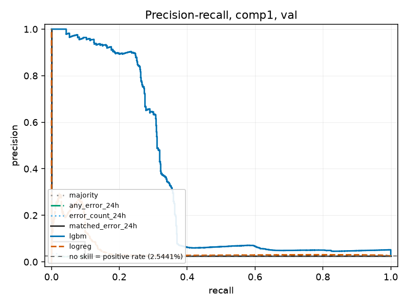

### comp2

72,000 rows, 624 positive (0.8667%), 3,027 bootstrap clusters.

| Series | Threshold | Precision | Recall | F1 | TP | FP | FN | TN |
|---|---|---|---|---|---|---|---|---|
| majority class (baseline 1) | 0.5000 | undefined | 0.000 (0.000-0.000) | undefined | 0 | 0 | 624 | 71,376 |
| any error in 24h (baseline 2) | 0.5000 | 0.085 (0.057-0.118) | 1.000 (1.000-1.000) | 0.157 | 624 | 6,707 | 0 | 64,669 |
| matched error code in 24h (baseline 2b) | 0.5000 | 0.278 (0.198-0.366) | 1.000 (1.000-1.000) | 0.435 | 624 | 1,621 | 0 | 69,755 |
| error count in 24h (graded variant) | 0.5000 | 0.085 (0.057-0.118) | 1.000 (1.000-1.000) | 0.157 | 624 | 6,707 | 0 | 64,669 |
| logistic regression (baseline 3) | 0.5800 | 0.973 (0.934-1.000) | 1.000 (1.000-1.000) | 0.987 | 624 | 17 | 0 | 71,359 |
| LightGBM | 0.9900 | 1.000 (1.000-1.000) | 1.000 (1.000-1.000) | 1.000 | 624 | 0 | 0 | 71,376 |

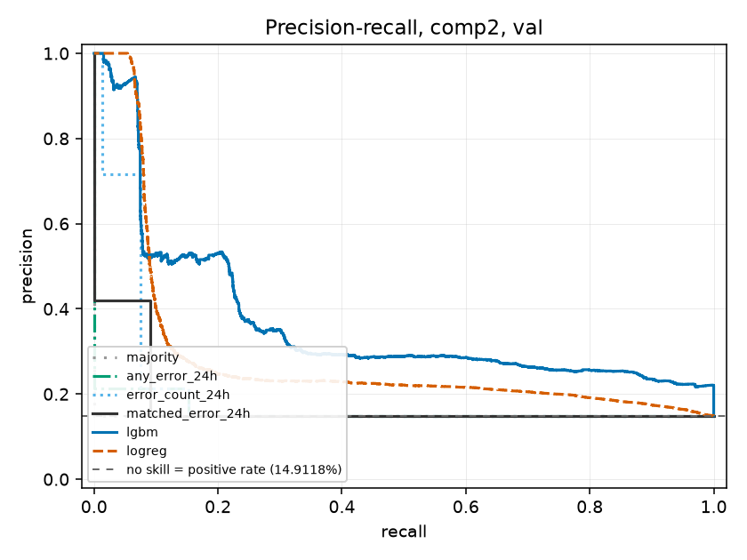

### comp3

72,000 rows, 186 positive (0.2583%), 3,008 bootstrap clusters.

| Series | Threshold | Precision | Recall | F1 | TP | FP | FN | TN |
|---|---|---|---|---|---|---|---|---|
| majority class (baseline 1) | 0.5000 | undefined | 0.000 (0.000-0.000) | undefined | 0 | 0 | 186 | 71,814 |
| any error in 24h (baseline 2) | 0.5000 | 0.025 (0.010-0.045) | 1.000 (1.000-1.000) | 0.049 | 186 | 7,145 | 0 | 64,669 |
| matched error code in 24h (baseline 2b) | 0.5000 | 0.123 (0.050-0.211) | 1.000 (1.000-1.000) | 0.220 | 186 | 1,322 | 0 | 70,492 |
| error count in 24h (graded variant) | 0.5000 | 0.025 (0.010-0.045) | 1.000 (1.000-1.000) | 0.049 | 186 | 7,145 | 0 | 64,669 |
| logistic regression (baseline 3) | 0.2573 | 0.930 (0.779-1.000) | 1.000 (1.000-1.000) | 0.964 | 186 | 14 | 0 | 71,800 |
| LightGBM | 0.9900 | 1.000 (1.000-1.000) | 1.000 (1.000-1.000) | 1.000 | 186 | 0 | 0 | 71,814 |

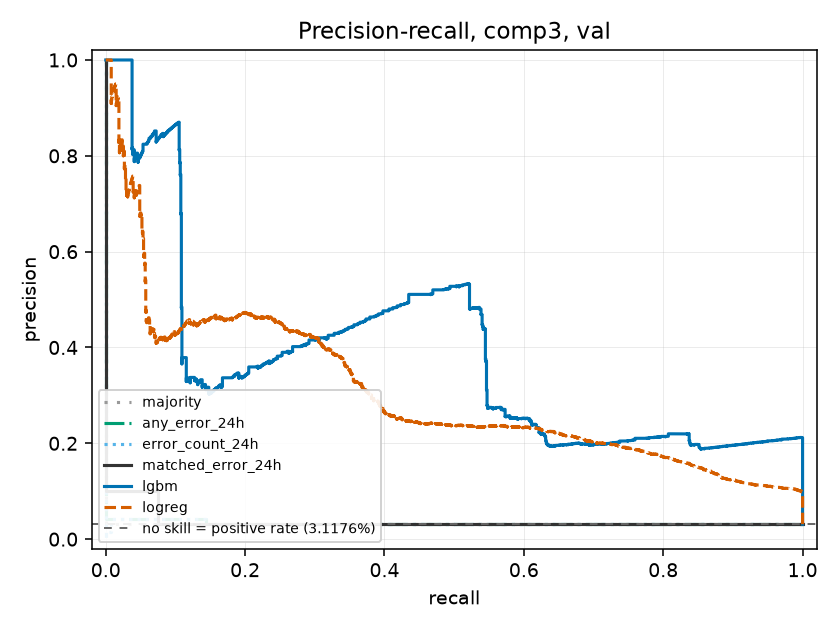

### comp4

72,000 rows, 336 positive (0.4667%), 3,015 bootstrap clusters.

| Series | Threshold | Precision | Recall | F1 | TP | FP | FN | TN |
|---|---|---|---|---|---|---|---|---|
| majority class (baseline 1) | 0.5000 | undefined | 0.000 (0.000-0.000) | undefined | 0 | 0 | 336 | 71,664 |
| any error in 24h (baseline 2) | 0.5000 | 0.046 (0.025-0.070) | 1.000 (1.000-1.000) | 0.088 | 336 | 6,995 | 0 | 64,669 |
| matched error code in 24h (baseline 2b) | 0.5000 | 0.444 (0.294-0.583) | 1.000 (1.000-1.000) | 0.615 | 336 | 421 | 0 | 71,243 |
| error count in 24h (graded variant) | 0.5000 | 0.046 (0.025-0.070) | 1.000 (1.000-1.000) | 0.088 | 336 | 6,995 | 0 | 64,669 |
| logistic regression (baseline 3) | 0.2876 | 0.997 (0.988-1.000) | 1.000 (1.000-1.000) | 0.999 | 336 | 1 | 0 | 71,663 |
| LightGBM | 0.9900 | 0.974 (0.899-1.000) | 0.988 (0.962-1.000) | 0.981 | 332 | 9 | 4 | 71,655 |

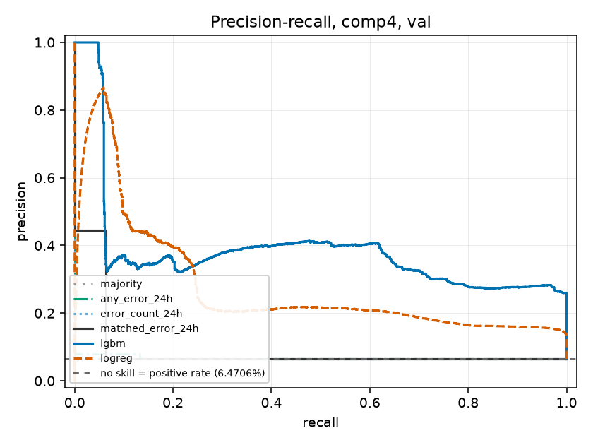

---

## 4. Calibration, validation

A later milestone has an agent acting on these probabilities, so they have to
mean what they say. The reference is the base-rate Brier score, `p(1-p)`, not
zero: on a 0.4% positive rate a model that outputs 0.004 for every row already
scores about 0.004, which reflects rarity rather than skill.

| Component | Brier, raw | Brier, isotonic | Brier, Platt | Base-rate reference | Skill score, raw |
|---|---|---|---|---|---|
| comp1 | 0.000000 | 0.000000 | 0.000000 | 0.002660 | 1.0000 |
| comp2 | 0.000000 | 0.000000 | 0.000001 | 0.008592 | 1.0000 |
| comp3 | 0.000000 | 0.000000 | 0.000000 | 0.002577 | 1.0000 |
| comp4 | 0.000181 | 0.000113 | 0.000178 | 0.004645 | 0.9611 |

**The after-calibration figures are optimistic.** The calibrator is fitted on
validation, as the milestone specifies, and then measured on the same rows.
The honest out-of-sample check is section 8, where this validation-fitted
calibrator is applied to the test split, which it has never seen.

Isotonic is preferred over Platt as the default. Platt fits a two-parameter
sigmoid and so assumes the miscalibration has a particular shape; isotonic
assumes only monotonicity, and 72,000 validation rows can afford it.

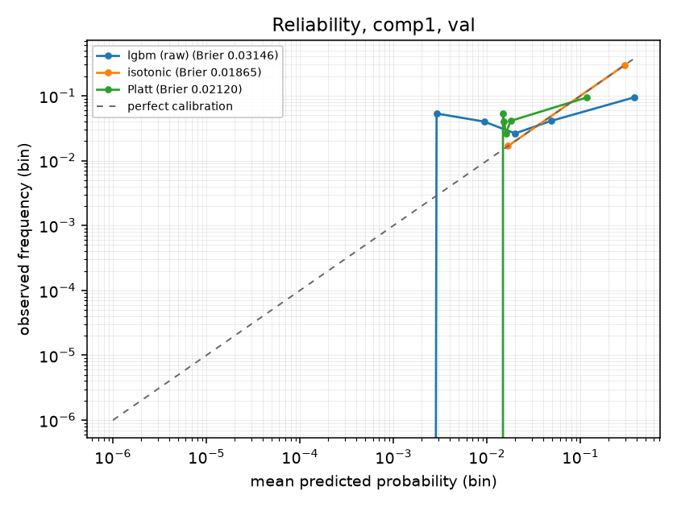
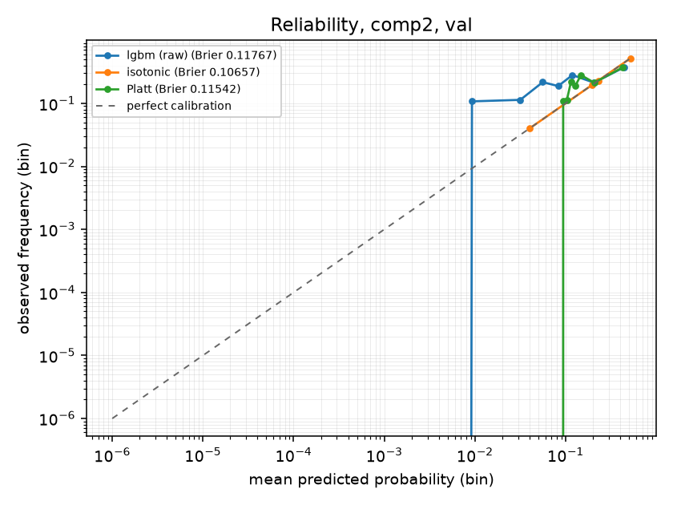
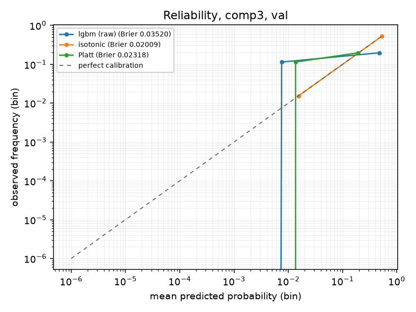
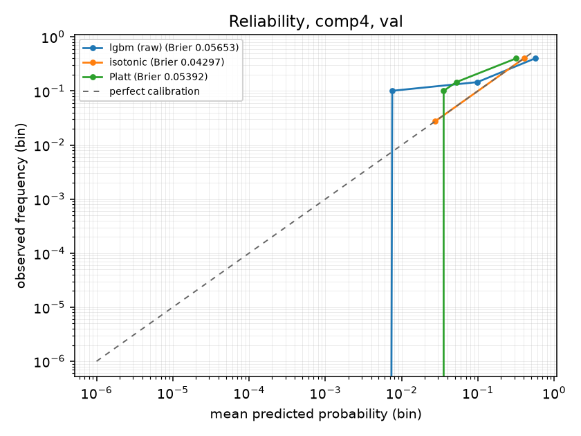

---

## 5. Thresholds from the cost assumption

`docs/DATA.md` section 4 states a missed failure costs 10x a false alarm. That
ratio is an assumption, not a measurement -- nothing here has touched a
factory. The point is not that 10:1 is right; it is that every threshold in
this project traces to a number written down somewhere and can be recomputed
when that number changes. v1 used hardcoded 0.5 and 0.8 bands with no stated
rationale at all.

Cost is measured in units of one false alarm:

```
cost(threshold) = FN(threshold) * ratio + FP(threshold)
```

Sensitivity of the chosen threshold to the assumed ratio:

| Component | 3:1 threshold | 3:1 recall | 3:1 precision | 10:1 threshold | 10:1 recall | 10:1 precision | 30:1 threshold | 30:1 recall | 30:1 precision |
|---|---|---|---|---|---|---|---|---|---|
| comp1 | 0.9900 | 1.000 | 1.000 | 0.9900 | 1.000 | 1.000 | 0.9900 | 1.000 | 1.000 |
| comp2 | 0.9900 | 1.000 | 1.000 | 0.9900 | 1.000 | 1.000 | 0.9900 | 1.000 | 1.000 |
| comp3 | 0.9900 | 1.000 | 1.000 | 0.9900 | 1.000 | 1.000 | 0.9900 | 1.000 | 1.000 |
| comp4 | 0.9900 | 0.988 | 0.974 | 0.9900 | 0.988 | 0.974 | 0.9900 | 0.988 | 0.974 |

Thresholds differ by component. That is expected: the components have
different base rates and different score distributions, so the point where one
more false alarm stops being worth one fewer miss is not the same for each.


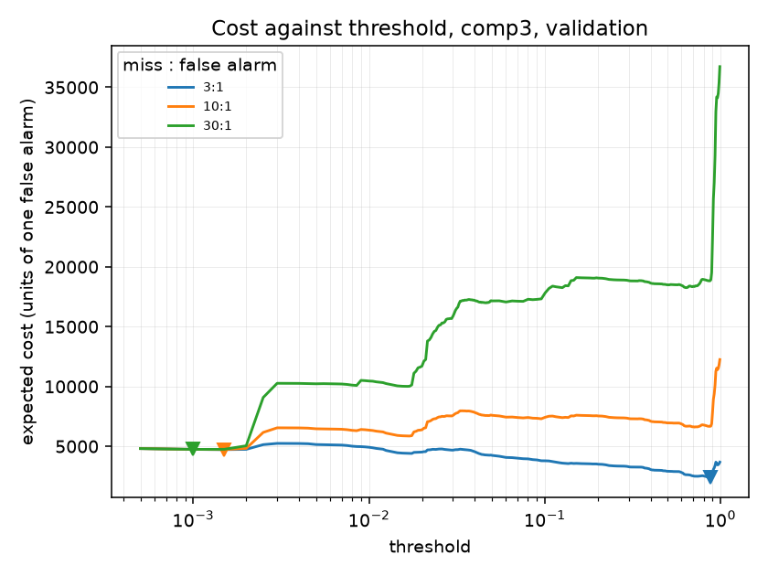
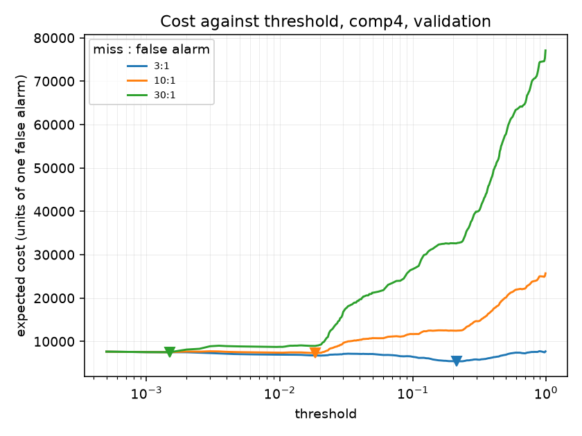

Each selected threshold is recorded in `data/generated/validation_results.json`
with the ratio it came from, and `src/eval/test_evaluation.py` reads it from
there rather than re-deriving it.

---

## 6. Uncertainty

The test period contains roughly 127 failure events across four components, so
per-component recall rests on tens of events, not hundreds. Point estimates
alone would be misleading.

Intervals are percentile bootstrap, 1,000 resamples, and
**resampled at the level of failure events rather than rows**:

- A positive row is clustered by the failure event that made it positive, so
  all ~24 rows one event produced move together. Resampling rows independently
  would treat them as 24 independent observations and produce an interval
  several times too narrow.
- A negative row is clustered by (machine, calendar day), which keeps the
  hour-to-hour autocorrelation `docs/DATA.md` section 5.2 describes.

Where an interval collapses to a single value, that is the separation in
section 0 showing through, not a bug: if no resample changes the ranking, the
bootstrap has nothing to spread.

---

## 7. Interpretability, and the leakage controls

Permutation importance on validation, not split-gain importance. Gain counts
how often a feature was chosen for a split, which is biased toward
high-cardinality features and is not a claim about predictive contribution.
Scored by average precision, 10 repeats per feature. The interval is the
spread across shuffles, which is uncertainty from the permutation, not from
the sample.

### comp1

| Rank | Feature | Mean PR-AUC drop | 95% interval |
|---|---|---|---|
| 1 | `volt_mean_24h` | 0.92682 | 0.91976 to 0.93388 |
| 2 | `error1_count_24h` | 0.80547 | 0.79826 to 0.81268 |
| 3 | `hours_since_comp1` | 0.01161 | 0.00958 to 0.01365 |
| 4 | `window_coverage_3h` | 0.00000 | 0.00000 to 0.00000 |
| 5 | `window_coverage_24h` | 0.00000 | 0.00000 to 0.00000 |
| 6 | `window_coverage_7d` | 0.00000 | 0.00000 to 0.00000 |
| 7 | `error2_count_24h` | 0.00000 | 0.00000 to 0.00000 |
| 8 | `error2_count_7d` | 0.00000 | 0.00000 to 0.00000 |
| 9 | `error3_count_24h` | 0.00000 | 0.00000 to 0.00000 |
| 10 | `error3_count_7d` | 0.00000 | 0.00000 to 0.00000 |

### comp2

| Rank | Feature | Mean PR-AUC drop | 95% interval |
|---|---|---|---|
| 1 | `rotate_mean_24h` | 0.22185 | 0.21079 to 0.23291 |
| 2 | `error3_count_24h` | 0.17256 | 0.15978 to 0.18535 |
| 3 | `error2_count_24h` | 0.05260 | 0.04670 to 0.05851 |
| 4 | `rotate_mean_3h` | 0.00000 | -0.00000 to 0.00000 |
| 5 | `volt_mean_3h` | 0.00000 | 0.00000 to 0.00000 |
| 6 | `volt_std_3h` | 0.00000 | 0.00000 to 0.00000 |
| 7 | `volt_mean_24h` | 0.00000 | 0.00000 to 0.00000 |
| 8 | `volt_std_24h` | 0.00000 | 0.00000 to 0.00000 |
| 9 | `rotate_std_3h` | 0.00000 | 0.00000 to 0.00000 |
| 10 | `rotate_std_24h` | 0.00000 | 0.00000 to 0.00000 |

### comp3

| Rank | Feature | Mean PR-AUC drop | 95% interval |
|---|---|---|---|
| 1 | `pressure_mean_24h` | 0.83588 | 0.82961 to 0.84214 |
| 2 | `error4_count_24h` | 0.76501 | 0.75952 to 0.77049 |
| 3 | `pressure_std_3h` | 0.00000 | 0.00000 to 0.00000 |
| 4 | `vibration_std_3h` | 0.00000 | 0.00000 to 0.00000 |
| 5 | `vibration_mean_24h` | 0.00000 | 0.00000 to 0.00000 |
| 6 | `vibration_std_24h` | 0.00000 | 0.00000 to 0.00000 |
| 7 | `hours_since_comp3` | 0.00000 | 0.00000 to 0.00000 |
| 8 | `rotate_std_3h` | 0.00000 | -0.00000 to 0.00000 |
| 9 | `volt_mean_3h` | 0.00000 | -0.00000 to 0.00000 |
| 10 | `pressure_std_24h` | 0.00000 | -0.00000 to 0.00000 |

### comp4

| Rank | Feature | Mean PR-AUC drop | 95% interval |
|---|---|---|---|
| 1 | `vibration_mean_24h` | 0.69226 | 0.68128 to 0.70325 |
| 2 | `error5_count_24h` | 0.48191 | 0.46978 to 0.49403 |
| 3 | `hours_since_comp4` | 0.01039 | 0.00892 to 0.01186 |
| 4 | `age` | 0.00747 | 0.00626 to 0.00868 |
| 5 | `vibration_std_24h` | 0.00207 | 0.00189 to 0.00225 |
| 6 | `hours_since_comp3` | 0.00104 | 0.00091 to 0.00117 |
| 7 | `rotate_std_24h` | 0.00051 | 0.00040 to 0.00063 |
| 8 | `hours_since_comp1` | 0.00026 | 0.00021 to 0.00031 |
| 9 | `vibration_mean_3h` | 0.00010 | -0.00014 to 0.00033 |
| 10 | `pressure_std_24h` | 0.00009 | 0.00006 to 0.00013 |

### Do the maintenance-recency features dominate?

**No.** The error-count features dominate, which is what section 0 predicts.
The `hours_since_*` features were the ones flagged as a leakage risk in
`docs/DATA.md` section 5.1 -- 743 of 761 failures carry a coincident `maint`
record -- so their not dominating is the outcome the guards were built to
produce. The guards still hold: `tests/test_no_future_leakage.py` passes, and
its assertions were each demonstrated to fail under a deliberate mutation.

`window_coverage_*` importance is zero by construction. Those features vary
only over the first 168 hours of the training split and are constant across
validation; `docs/FEATURES.md` records this so a zero is not read as a defect.

### Two controls that separate 'clean pipeline' from 'leaking pipeline'

| Control | Result | What it rules out |
|---|---|---|
| Shuffle the training labels, retrain, score validation | PR-AUC 0.00261 against a base rate of 0.00267 | Any path from features to labels that does not go through the signal |
| Train on 80 machines, score 20 unseen machines in an unseen month | PR-AUC 1.0000, still perfectly separated | Memorisation of specific machines or timestamps |

The first collapsing to the base rate and the second holding up is the
signature of a real, learnable mechanism in the data rather than a leak.

---

## Appendix: ROC-AUC

Reported here and nowhere else. With positive rates between 0.27% and 0.87% on
validation, ROC-AUC is dominated by the hundreds of thousands of true
negatives and will look excellent whether or not the model is useful.

| Component | LightGBM | Logistic regression | any error in 24h |
|---|---|---|---|
| comp1 | 1.0000 | 0.9999 | 0.9503 |
| comp2 | 1.0000 | 1.0000 | 0.9530 |
| comp3 | 1.0000 | 0.9999 | 0.9503 |
| comp4 | 1.0000 | 1.0000 | 0.9512 |

---

## What this model cannot do

- **It has never seen real plant data.** The dataset is a Microsoft teaching
  simulation. Section 0 shows the failure mechanism is close to deterministic,
  which is not how real machines fail. Nothing here supports a claim about
  real-world downtime, cost, or lead time.
- **It cannot be trusted on a component whose fault signature differs.** The
  models lean on the error codes described in section 0. On a plant where
  those codes are absent, noisy, or logged after the failure rather than
  before, performance is unknown and there is no reason to expect it to
  transfer.
- **Its training data contains 18 anomalous positives.** `docs/DATA.md`
  section 5.1: 18 failure records at `2015-01-02 03:00` have no corresponding
  replacement anywhere in the maintenance log, and the cause is unestablished.
  They are all in the training split, inside the partial-window warm-up region.
- **Its confidence intervals are narrow because the problem is easy, not
  because the sample is large.** The test period holds roughly 127 failure
  events. On a harder problem, intervals built from that many events would be
  wide, and section 6's method is what would show it.
- **It predicts a 24-hour window, and nothing else.** Not remaining useful
  life, not severity, not which part to order. The parts inventory it would
  need for that is synthetic (`docs/DATA.md` section 6).

<!-- test-evaluation-appended-below -->

## 8. Test split, evaluated once

This is run 1. The test split has been read exactly once, at `2026-08-09T13:15:39Z`, against model fingerprint `c0179ef3b00a1dd5` and commit `0876f49a7a`.

Thresholds and calibrators come from validation and were not re-derived
here. No model, hyperparameter or feature decision was made after this
section was produced.

### PR-AUC

| Component | majority class (baseline 1) | any error in 24h (baseline 2) | matched error code in 24h (baseline 2b) | error count in 24h (graded variant) | logistic regression (baseline 3) | LightGBM | no-skill floor |
|---|---|---|---|---|---|---|---|
| comp1 | 0.005 (0.003-0.006) | 0.051 (0.033-0.069) | 0.189 (0.127-0.249) | 0.093 (0.038-0.187) | 0.910 (0.807-0.977) | 0.992 (0.976-1.000) | 0.00457 |
| comp2 | 0.007 (0.005-0.009) | 0.083 (0.061-0.103) | 0.271 (0.207-0.332) | 0.698 (0.599-0.780) | 1.000 (1.000-1.000) | 1.000 (1.000-1.000) | 0.00746 |
| comp3 | 0.003 (0.002-0.005) | 0.035 (0.021-0.051) | 0.144 (0.088-0.202) | 0.038 (0.022-0.063) | 0.995 (0.981-1.000) | 1.000 (1.000-1.000) | 0.00312 |
| comp4 | 0.004 (0.003-0.006) | 0.045 (0.029-0.064) | 0.532 (0.394-0.665) | 0.066 (0.033-0.134) | 0.999 (0.996-1.000) | 0.997 (0.989-1.000) | 0.00410 |

### comp1

142,300 rows, 651 positive (0.4575%), 6,030 bootstrap clusters.

| Series | Threshold | Precision | Recall | F1 | TP | FP | FN | TN |
|---|---|---|---|---|---|---|---|---|
| majority class (baseline 1) | 0.5000 | undefined | 0.000 (0.000-0.000) | undefined | 0 | 0 | 651 | 141,649 |
| any error in 24h (baseline 2) | 0.5000 | 0.051 (0.033-0.069) | 1.000 (1.000-1.000) | 0.097 | 651 | 12,179 | 0 | 129,470 |
| matched error code in 24h (baseline 2b) | 0.5000 | 0.189 (0.127-0.249) | 1.000 (1.000-1.000) | 0.317 | 651 | 2,800 | 0 | 138,849 |
| error count in 24h (graded variant) | 0.5000 | 0.051 (0.033-0.069) | 1.000 (1.000-1.000) | 0.097 | 651 | 12,179 | 0 | 129,470 |
| logistic regression (baseline 3) | 0.2169 | 0.783 (0.668-0.874) | 0.997 (0.991-1.000) | 0.877 | 649 | 180 | 2 | 141,469 |
| LightGBM | 0.9900 | 0.972 (0.921-0.999) | 0.995 (0.988-1.000) | 0.983 | 648 | 19 | 3 | 141,630 |

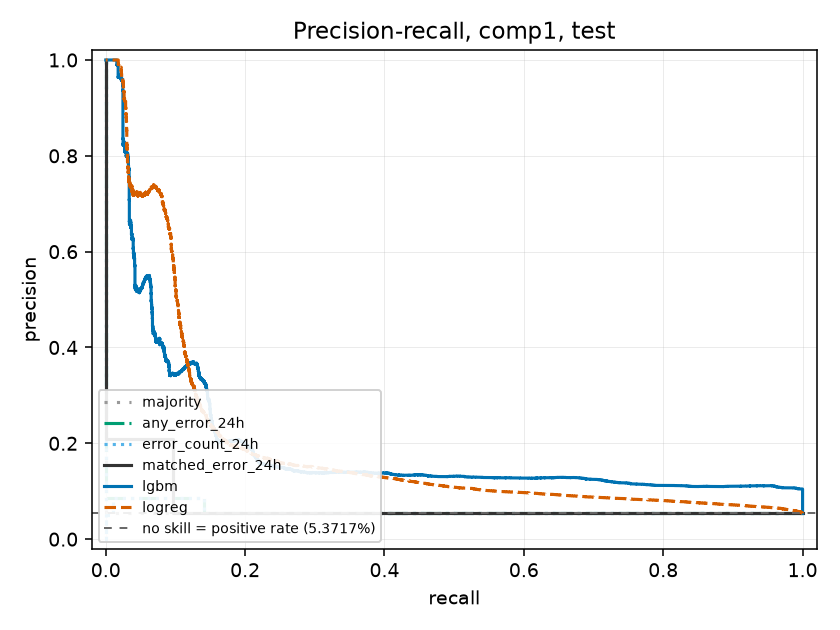

### comp2

142,300 rows, 1,062 positive (0.7463%), 6,045 bootstrap clusters.

| Series | Threshold | Precision | Recall | F1 | TP | FP | FN | TN |
|---|---|---|---|---|---|---|---|---|
| majority class (baseline 1) | 0.5000 | undefined | 0.000 (0.000-0.000) | undefined | 0 | 0 | 1,062 | 141,238 |
| any error in 24h (baseline 2) | 0.5000 | 0.083 (0.061-0.103) | 1.000 (1.000-1.000) | 0.153 | 1,062 | 11,768 | 0 | 129,470 |
| matched error code in 24h (baseline 2b) | 0.5000 | 0.271 (0.207-0.332) | 1.000 (1.000-1.000) | 0.427 | 1,062 | 2,851 | 0 | 138,387 |
| error count in 24h (graded variant) | 0.5000 | 0.083 (0.061-0.103) | 1.000 (1.000-1.000) | 0.153 | 1,062 | 11,768 | 0 | 129,470 |
| logistic regression (baseline 3) | 0.5800 | 1.000 (1.000-1.000) | 1.000 (1.000-1.000) | 1.000 | 1,062 | 0 | 0 | 141,238 |
| LightGBM | 0.9900 | 1.000 (1.000-1.000) | 1.000 (1.000-1.000) | 1.000 | 1,062 | 0 | 0 | 141,238 |

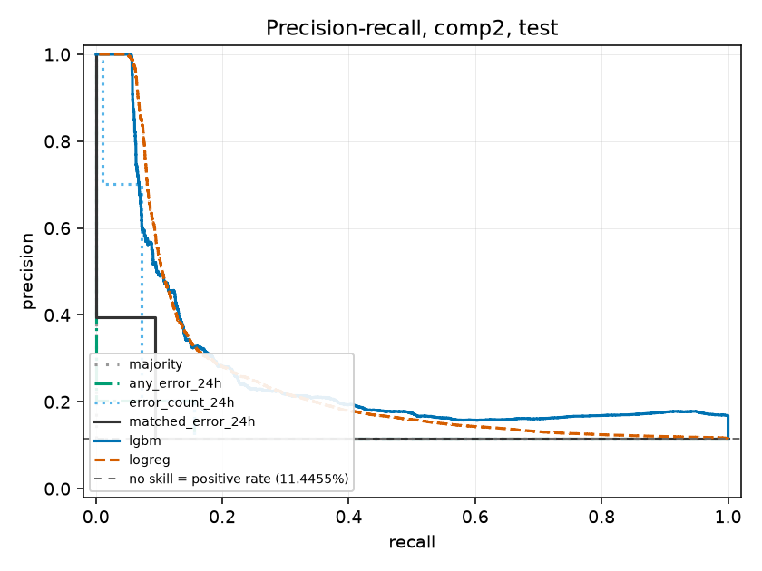

### comp3

142,300 rows, 444 positive (0.3120%), 6,020 bootstrap clusters.

| Series | Threshold | Precision | Recall | F1 | TP | FP | FN | TN |
|---|---|---|---|---|---|---|---|---|
| majority class (baseline 1) | 0.5000 | undefined | 0.000 (0.000-0.000) | undefined | 0 | 0 | 444 | 141,856 |
| any error in 24h (baseline 2) | 0.5000 | 0.035 (0.021-0.051) | 1.000 (1.000-1.000) | 0.067 | 444 | 12,386 | 0 | 129,470 |
| matched error code in 24h (baseline 2b) | 0.5000 | 0.144 (0.088-0.202) | 1.000 (1.000-1.000) | 0.251 | 444 | 2,645 | 0 | 139,211 |
| error count in 24h (graded variant) | 0.5000 | 0.035 (0.021-0.051) | 1.000 (1.000-1.000) | 0.067 | 444 | 12,386 | 0 | 129,470 |
| logistic regression (baseline 3) | 0.2573 | 0.965 (0.914-0.998) | 1.000 (1.000-1.000) | 0.982 | 444 | 16 | 0 | 141,840 |
| LightGBM | 0.9900 | 1.000 (1.000-1.000) | 1.000 (1.000-1.000) | 1.000 | 444 | 0 | 0 | 141,856 |

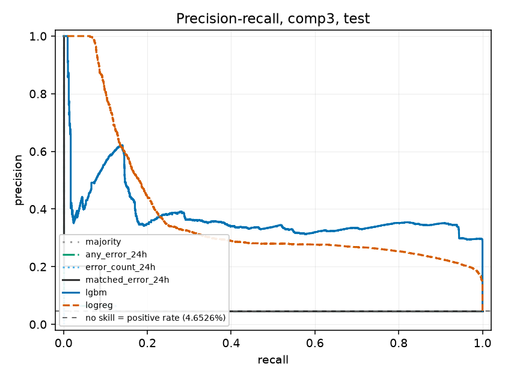

### comp4

142,300 rows, 583 positive (0.4097%), 6,026 bootstrap clusters.

| Series | Threshold | Precision | Recall | F1 | TP | FP | FN | TN |
|---|---|---|---|---|---|---|---|---|
| majority class (baseline 1) | 0.5000 | undefined | 0.000 (0.000-0.000) | undefined | 0 | 0 | 583 | 141,717 |
| any error in 24h (baseline 2) | 0.5000 | 0.045 (0.029-0.064) | 1.000 (1.000-1.000) | 0.087 | 583 | 12,247 | 0 | 129,470 |
| matched error code in 24h (baseline 2b) | 0.5000 | 0.532 (0.394-0.665) | 1.000 (1.000-1.000) | 0.694 | 583 | 513 | 0 | 141,204 |
| error count in 24h (graded variant) | 0.5000 | 0.045 (0.029-0.064) | 1.000 (1.000-1.000) | 0.087 | 583 | 12,247 | 0 | 129,470 |
| logistic regression (baseline 3) | 0.2876 | 0.970 (0.929-0.997) | 1.000 (1.000-1.000) | 0.985 | 583 | 18 | 0 | 141,699 |
| LightGBM | 0.9900 | 0.990 (0.962-1.000) | 1.000 (1.000-1.000) | 0.995 | 583 | 6 | 0 | 141,711 |

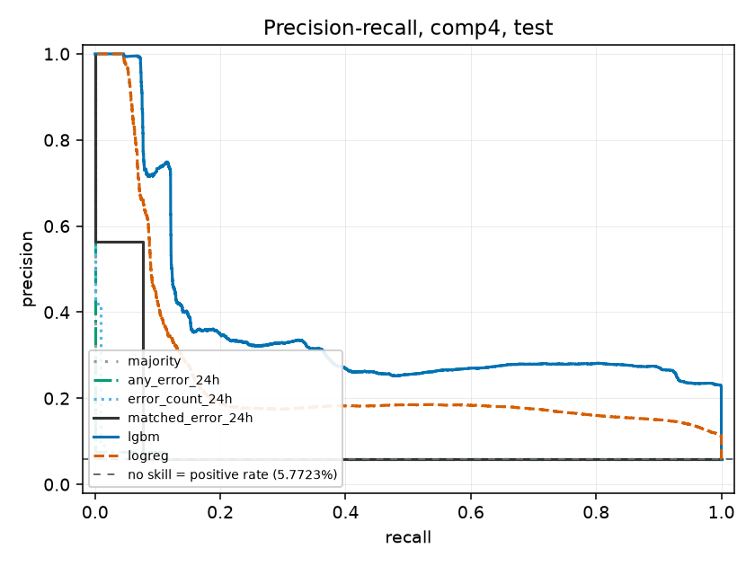

### Calibration, out of sample

The isotonic calibrator was fitted on validation and applied here unchanged.
Unlike the validation figures in section 4, these are genuinely out of sample.

| Component | Brier, raw | Brier, isotonic (fitted on val) | Base-rate reference |
|---|---|---|---|
| comp1 | 0.000189 | 0.000189 | 0.004554 |
| comp2 | 0.000000 | 0.000000 | 0.007407 |
| comp3 | 0.000000 | 0.000000 | 0.003110 |
| comp4 | 0.000042 | 0.000066 | 0.004080 |

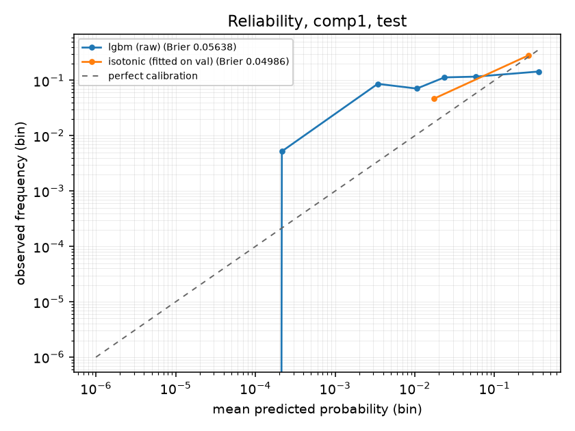
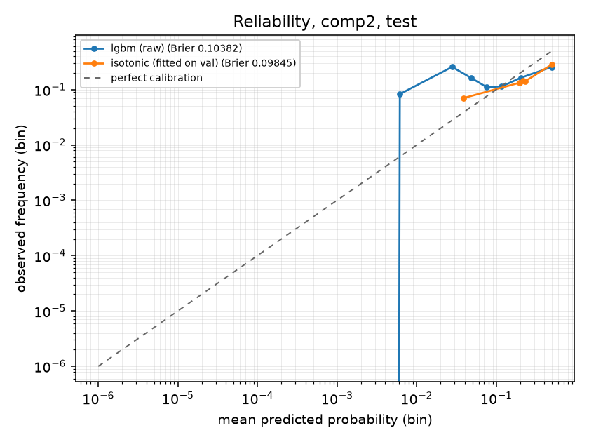
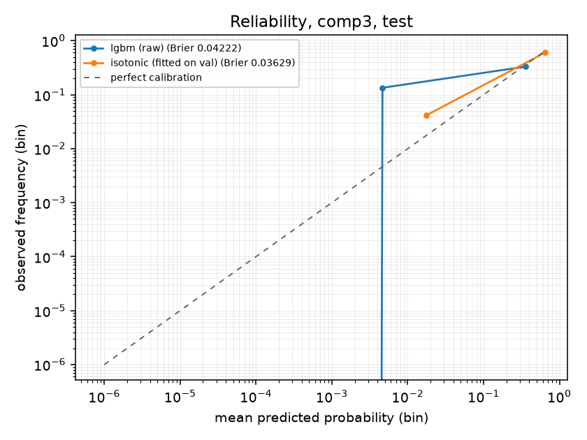
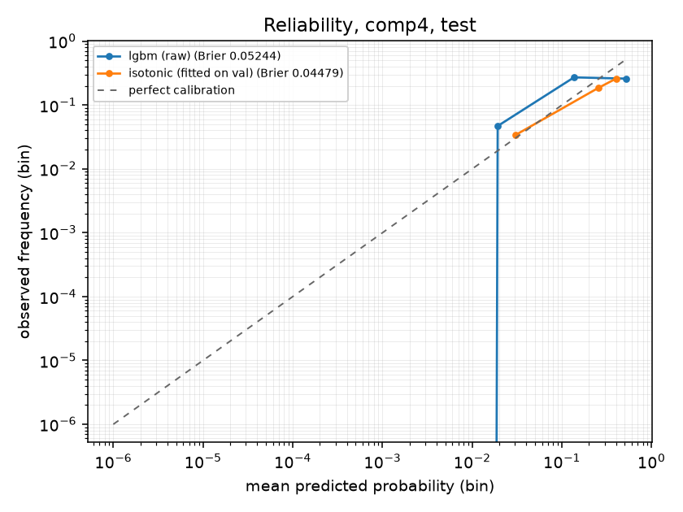

### Appendix: ROC-AUC on test

| Component | LightGBM | Logistic regression | matched error code |
|---|---|---|---|
| comp1 | 1.0000 | 0.9997 | 0.9901 |
| comp2 | 1.0000 | 1.0000 | 0.9899 |
| comp3 | 1.0000 | 1.0000 | 0.9907 |
| comp4 | 1.0000 | 1.0000 | 0.9982 |

### Anything wanted after seeing these numbers

Nothing was changed after this section was produced. Recorded for honesty:
the model is close to the ceiling on this data, so there is no tuning to
want; what a second pass would change is the *dataset*, not the model, and
that is a Milestone 4 question rather than a reason to touch these figures.
