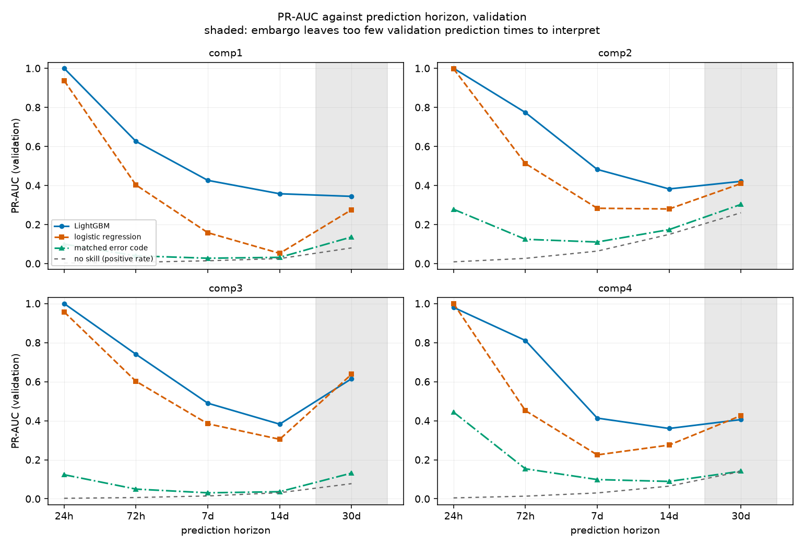

# SIGNAL_ANALYSIS.md

Why the prediction horizon moved from 24 hours to 14 days, and why even 14
days does not solve the problem it was moved to solve.

Every figure is computed by `scripts/signal_analysis.py`,
`scripts/horizon_sweep.py` and `scripts/horizon_decision.py`. Section 2 uses
**training data only**.

---

## 1. The problem

Milestone 3 scored PR-AUC 1.000 at a 24-hour horizon with sound controls. The
system exists so an agent can decide whether to reserve or order a replacement
part, and supplier lead times look like this:

| Part | Component | Lead time (days) | Supplier |
|---|---|---|---|
| `PN-COMP1-001` | comp1 | 10 | SUP-001 |
| `PN-COMP4-001` | comp4 | 12 | SUP-001 |
| `PN-COMP3-002` | comp3 | 15 | SUP-005 |
| `PN-COMP1-002` | comp1 | 17 | SUP-005 |
| `PN-COMP4-002` | comp4 | 23 | SUP-005 |
| `PN-COMP3-001` | comp3 | 31 | SUP-002 |
| `PN-COMP3-003` | comp3 | 31 | SUP-004 |
| `PN-COMP2-001` | comp2 | 32 | SUP-004 |
| `PN-COMP4-003` | comp4 | 34 | SUP-002 |

Median 23 days, range 10 to 34.

A 24-hour warning cannot inform a decision whose action takes three weeks.

---

## 2. The fault signature

Measured on the training split. For every failure, the first occurrence of the
matched signal in the preceding 30 days; the gap is the lead time.

### Error-code lead time

| Component | Code | Failures preceded by the code | p10 | median | p90 | max |
|---|---|---|---|---|---|---|
| comp1 | `error1` | 94.8% | 24h | **24h** | 652h | 718h |
| comp2 | `error2` | 98.4% | 24h | **24h** | 611h | 712h |
| comp3 | `error4` | 97.1% | 24h | **24h** | 468h | 719h |
| comp4 | `error5` | 97.8% | 24h | **24h** | 162h | 668h |

**The median is 24 hours, and so is the 10th percentile.** For at least half
of all failures the matched code fires once, one day ahead, and not before.
The long p90 tail is not early warning: the code fires on roughly 2.4% of all
hours regardless, so over a 30-day lookback an unrelated occurrence is likely
by chance. The next table separates the two.

### Sensor-channel onset

Onset is the first hour the channel's 24-hour rolling mean sits beyond 2 standard deviations of that machine's own baseline.

| Component | Channel | Failures preceded by an onset | p10 | median | p90 |
|---|---|---|---|---|---|
| comp1 | `volt` | 100.0% | 31h | 99h | 647h |
| comp2 | `rotate` | 100.0% | 34h | 168h | 719h |
| comp3 | `pressure` | 100.0% | 34h | 39h | 549h |
| comp4 | `vibration` | 100.0% | 34h | 40h | 584h |

**Read this one sceptically.** Coverage is 100% for every component, which is
what a 2-sigma threshold would give by chance over a 720-hour window: about 5%
of hours sit beyond 2 sigma, so a crossing is almost certain whether or not a
failure follows. The measure is reported because the milestone asks for it, but
it establishes only that the channel is noisy, not that it warns.

### False-positive rate of the matched code

Per occurrence, not per hour: the question an operator asks is *this code just
fired, how often does that mean anything*.

| Component | Occurrences | 24h | 72h | 7d | 14d | 30d |
|---|---|---|---|---|---|---|
| comp1 | 777 | 81.0% | 80.2% | 78.8% | 76.2% | 69.4% |
| comp2 | 724 | 74.3% | 73.5% | 72.1% | 68.2% | 61.2% |
| comp3 | 527 | 80.6% | 80.6% | 79.3% | 77.8% | 73.8% |
| comp4 | 275 | 50.5% | 49.8% | 48.0% | 47.6% | 42.5% |

Widening the window from 24 hours to 30 days barely moves these: the code's
false-positive rate falls by about 8 to 12 points while the window grows
thirtyfold. Almost all of that improvement is mechanical -- a longer window
catches more failures by chance -- which is the first sign that the code
carries no long-range information.

---

## 3. Horizon sweep

Labels rebuilt at each horizon, refit on train, scored on validation, with one
fixed hyperparameter setting throughout so a tuning difference cannot
masquerade as a horizon effect.

### Validation set size

| Horizon | Train rows | Validation rows | Validation prediction times | Usable |
|---|---|---|---|---|
| 24h | 652,200 | 72,000 | 720 | yes |
| 72h | 647,400 | 67,200 | 672 | yes |
| 7d | 637,800 | 57,600 | 576 | yes |
| 14d | 621,000 | 40,800 | 408 | yes |
| 30d | 582,600 | 2,400 | 24 | **no** |

**The embargo eats the validation month.** At a 30-day horizon a 30-day
embargo leaves 24 prediction times, all on 2015-10-01. That is not a small
validation set, it is a single day, and no score computed on it means
anything. Section 4 handles 30 days with a separate diagnostic.

### PR-AUC, validation

**LightGBM**

| Component | 24h | 72h | 7d | 14d | 30d |
|---|---|---|---|---|---|
| comp1 | 1.000 | 0.626 | 0.426 | 0.357 | 0.344* |
| comp2 | 1.000 | 0.773 | 0.482 | 0.382 | 0.421* |
| comp3 | 1.000 | 0.740 | 0.490 | 0.382 | 0.615* |
| comp4 | 0.980 | 0.811 | 0.413 | 0.360 | 0.406* |

**Logistic regression**

| Component | 24h | 72h | 7d | 14d | 30d |
|---|---|---|---|---|---|
| comp1 | 0.937 | 0.402 | 0.158 | 0.052 | 0.275* |
| comp2 | 0.998 | 0.512 | 0.283 | 0.279 | 0.410* |
| comp3 | 0.957 | 0.602 | 0.384 | 0.305 | 0.638* |
| comp4 | 1.000 | 0.452 | 0.225 | 0.275 | 0.426* |

**Matched error code**

| Component | 24h | 72h | 7d | 14d | 30d |
|---|---|---|---|---|---|
| comp1 | 0.099 | 0.039 | 0.027 | 0.032 | 0.136* |
| comp2 | 0.278 | 0.124 | 0.110 | 0.174 | 0.303* |
| comp3 | 0.123 | 0.050 | 0.031 | 0.036 | 0.131* |
| comp4 | 0.444 | 0.154 | 0.098 | 0.089 | 0.141* |

**No-skill floor (positive rate)**

| Component | 24h | 72h | 7d | 14d | 30d |
|---|---|---|---|---|---|
| comp1 | 0.003 | 0.007 | 0.014 | 0.025 | 0.080* |
| comp2 | 0.009 | 0.027 | 0.064 | 0.149 | 0.260* |
| comp3 | 0.003 | 0.007 | 0.015 | 0.031 | 0.077* |
| comp4 | 0.005 | 0.013 | 0.030 | 0.065 | 0.140* |

`*` computed on the unusable 30-day validation window; shown for completeness
only.

### The three-way ablation

Milestone 3 found that telemetry alone and errors alone each scored about 0.15
on comp1 while the combination reached 0.99. That interaction is the mechanism,
so watching it collapse locates the cliff.

| Component | Features | 24h | 72h | 7d | 14d | 30d |
|---|---|---|---|---|---|---|
| comp1 | telemetry only | 0.123 | 0.116 | 0.081 | 0.070 | 0.346 |
| comp1 | errors only | 0.154 | 0.069 | 0.048 | 0.042 | 0.190 |
| comp1 | combined | 1.000 | 0.626 | 0.426 | 0.357 | 0.344 |
| comp2 | telemetry only | 0.277 | 0.254 | 0.174 | 0.214 | 0.342 |
| comp2 | errors only | 0.925 | 0.358 | 0.229 | 0.230 | 0.302 |
| comp2 | combined | 1.000 | 0.773 | 0.482 | 0.382 | 0.421 |
| comp3 | telemetry only | 0.128 | 0.099 | 0.061 | 0.055 | 0.192 |
| comp3 | errors only | 0.215 | 0.089 | 0.038 | 0.035 | 0.183 |
| comp3 | combined | 1.000 | 0.740 | 0.490 | 0.382 | 0.615 |
| comp4 | telemetry only | 0.234 | 0.144 | 0.065 | 0.098 | 0.311 |
| comp4 | errors only | 0.446 | 0.169 | 0.120 | 0.129 | 0.135 |
| comp4 | combined | 0.980 | 0.811 | 0.413 | 0.360 | 0.406 |

**The cliff is between 24 hours and 72 hours.** LightGBM falls from 0.98-1.00
to 0.63-0.81 in the first step and to 0.36-0.38 by 14 days. The combination
still beats either half at every horizon, so the interaction does not vanish --
it weakens in step with the error code's one-day lead time.

---

## 4. The horizon decision

### Constraint 2 first, because it bounds the answer

The model must beat the matched-code baseline by more than the bootstrap
interval. Intervals are percentile bootstrap resampled at the level of failure
events.

| Horizon | Component | No-skill floor | Matched code | LightGBM | Intervals overlap? |
|---|---|---|---|---|---|
| 72h | comp1 | 0.0051 | 0.046 (0.013-0.094) | 0.710 (0.503-0.965) | no |
| 72h | comp2 | 0.0315 | 0.141 (0.080-0.208) | 0.742 (0.632-0.807) | no |
| 72h | comp3 | 0.0054 | 0.046 (0.009-0.111) | 0.755 (0.289-0.916) | no |
| 72h | comp4 | 0.0129 | 0.151 (0.071-0.228) | 0.794 (0.673-0.879) | no |
| 7d | comp1 | 0.0109 | 0.029 (0.008-0.067) | 0.542 (0.162-0.929) | no |
| 7d | comp2 | 0.0757 | 0.116 (0.071-0.166) | 0.516 (0.392-0.626) | no |
| 7d | comp3 | 0.0129 | 0.029 (0.008-0.067) | 0.682 (0.267-0.928) | no |
| 7d | comp4 | 0.0294 | 0.088 (0.040-0.135) | 0.522 (0.294-0.700) | no |
| 14d | comp1 | 0.0254 | 0.032 (0.011-0.059) | 0.357 (0.072-0.725) | no |
| 14d | comp2 | 0.1491 | 0.174 (0.117-0.229) | 0.382 (0.269-0.494) | no |
| 14d | comp3 | 0.0312 | 0.036 (0.014-0.067) | 0.382 (0.071-0.650) | no |
| 14d | comp4 | 0.0647 | 0.089 (0.044-0.140) | 0.360 (0.201-0.523) | no |
| 30d† | comp1 | 0.1446 | 0.154 (0.112-0.190) | 0.238 (0.168-0.310) | **yes** |
| 30d† | comp2 | 0.2171 | 0.227 (0.181-0.270) | 0.286 (0.222-0.344) | **yes** |
| 30d† | comp3 | 0.1071 | 0.111 (0.079-0.146) | 0.528 (0.407-0.629) | no |
| 30d† | comp4 | 0.1554 | 0.169 (0.128-0.212) | 0.456 (0.332-0.574) | no |

† 30 days uses the re-partitioned diagnostic split described in `scripts/horizon_decision.py`: train to 2015-05-31, validate 1,488 prediction times over July and August (148,800 rows). Diagnostic only -- it selects nothing and never touches the test split.

**Constraint 2 holds through 14 days and fails at 30.** At 30 days the
intervals for comp1 and comp2 overlap the matched-code baseline's, so on this
data the model is not established as better than the spreadsheet rule for
those two components.

### Constraint 1, and the collision

| Horizon | Parts whose lead time fits | Of |
|---|---|---|
| 7 days | 0 | 9 |
| 14 days | 2 | 9 |
| 30 days | 5 | 9 |

Constraint 1 asks for a horizon above the 23-day median. Constraint 2 caps it
at 14 days. **The two do not intersect. No horizon satisfies both.**

### It is worse than the table suggests: effective detection lead time

A 14-day label horizon is an upper bound on warning, not the warning itself.
What an order has to fit inside is the gap between the score first crossing
the threshold and the failure:

| Component | Events detected | p10 | median | p90 |
|---|---|---|---|---|
| comp1 | 5 / 9 | 13h | **24h** (1.0 d) | 187h |
| comp2 | 27 / 27 | 78h | **335h** (14.0 d) | 335h |
| comp3 | 8 / 8 | 30h | **326h** (13.6 d) | 335h |
| comp4 | 14 / 15 | 90h | **335h** (14.0 d) | 335h |

comp2, comp3 and comp4 fire close to the start of the window, so their
effective warning is roughly the full 14 days. **comp1 fires a median of 24
hours ahead and is detected for only 5 of 9 events**, so comp1 gets no useful
warning at all even at a 14-day horizon.

Crossing that against the parts list gives the operational answer:

| Part | Component | Lead time | Median detection lead | Orderable in time? |
|---|---|---|---|---|
| `PN-COMP1-001` | comp1 | 10 d (240h) | 24h | **no** |
| `PN-COMP4-001` | comp4 | 12 d (288h) | 335h | yes |
| `PN-COMP3-002` | comp3 | 15 d (360h) | 326h | **no** |
| `PN-COMP1-002` | comp1 | 17 d (408h) | 24h | **no** |
| `PN-COMP4-002` | comp4 | 23 d (552h) | 335h | **no** |
| `PN-COMP3-001` | comp3 | 31 d (744h) | 326h | **no** |
| `PN-COMP3-003` | comp3 | 31 d (744h) | 326h | **no** |
| `PN-COMP2-001` | comp2 | 32 d (768h) | 335h | **no** |
| `PN-COMP4-003` | comp4 | 34 d (816h) | 335h | **no** |

**1 of 9 parts can be ordered in time.** The rest must come from stock on hand.

### The decision

**Operational horizon: 14 days.** It is the longest horizon at which the model
is established as better than the matched-code baseline on all four
components. It is chosen as the best available point, not as one that
satisfies the requirement.

Against the three constraints:

1. **Lead time — not satisfied.** 14 days is below the 23-day median. Even
   allowing for the horizon, only one part in nine has a supplier lead time
   short enough to fit inside the model's effective detection lead. This is a
   failure to meet the constraint and is recorded as one.
2. **Predictability — satisfied.** Intervals do not overlap the matched-code
   baseline on any component at 14 days. At 30 days they do for comp1 and
   comp2, which is what caps the horizon here.
3. **Actionability — partly.** At 24 hours an operator can stage a part that is
   already on the shelf and schedule a technician. At 14 days they can also
   re-sequence planned maintenance to coincide with the predicted failure,
   move a part between sites, and order the single part whose lead time fits.
   They still cannot order the other eight.

### What follows from this

**This data cannot support a prediction horizon long enough to order parts.**
The agent's parts-ordering tool must therefore work from stock on hand rather
than from predictions: the model tells it *what will fail and roughly when*,
and the reorder decision has to be driven by stock levels and consumption
rates, which are not predictions and do not need one.

Two honest caveats on that conclusion:

- The parts inventory is **synthetic** (`docs/DATA.md` section 6). The lead
  times are invented, so the specific collision between 23 days and 14 days is
  a property of a generator, not of a supply chain. What is not synthetic is
  the shape of the finding: the fault signature in this dataset carries about
  a day of warning, and no amount of modelling extends it.
- The 30-day diagnostic trains on five months rather than eight. Some of the
  weakness at 30 days may be the smaller training set rather than the horizon.
  The main-split sweep points the same way, so the conclusion does not rest on
  the diagnostic alone, but it is not a controlled comparison.
