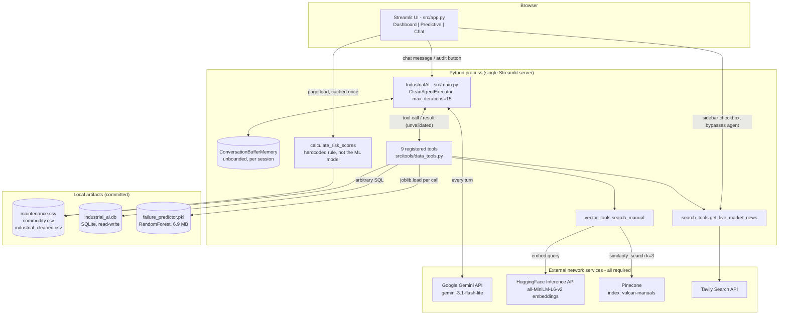

> **This document describes the archived v1 of this project (`archive/v1-app/`, `archive/v1-data/`). It is a historical record and does not describe the current codebase.**

# Industrial AI Agent — engineering design document

> Draft. Replaces the claims in the repository's current `README.md`, which contains statements that
> do not match the code. Every figure below was measured against the committed artifacts or read from
> the source; anything unmeasured says so.

## 1. What this is

A Streamlit application that puts a Gemini tool-calling agent in front of four static maintenance and
supply-chain datasets, a pickled scikit-learn failure classifier, and a vector index built from one
electric-motor service manual. The agent decides which of nine tools to call in response to a
free-text question and writes an answer from what they return.

It is a portfolio and learning project. It has never been connected to a machine, a historian, an MES,
or any live data source.

## 2. Problem statement and scope

The question the project explores: can a tool-calling LLM act as a front end over the mixed data a
maintenance engineer would otherwise query by hand — sensor tables, a failure classifier, a service
manual, supplier records, commodity prices — and produce a single coherent answer?

In scope:

- A tool-calling agent loop with nine tools over local files, a SQLite database, and a remote vector index.
- A binary failure classifier served as one of those tools.
- Retrieval over a single PDF service manual.
- A Streamlit UI: a dashboard, a health-tile view, and a chat tab.

### Non-goals

- **Not a real-time system.** There is no data ingestion path. All four datasets are committed files
  with fixed contents; the newest is a snapshot, not a stream. Nothing polls, subscribes to, or
  refreshes anything.
- **Not a forecasting system.** The classifier scores one row of five instantaneous readings. It has no
  time dimension, no prediction horizon, and no notion of lead time.
- **Not multi-user.** No authentication, no authorisation, no per-user quota. Every visitor shares one
  set of API keys.
- **Not offline or edge-deployable.** Four external network services are on the critical path (§4).
- **Not evaluated.** No accuracy, latency, or retrieval-quality measurement exists in this repository (§6).
- **Not a decision system.** Nothing here should be used to decide whether to service a machine.

## 3. Data

Four datasets and one PDF, all committed as artifacts. Two have a generation script in the repository;
three do not.

### 3.1 `data/maintenance.csv` — 10,000 rows × 14 columns, 522,048 bytes

One row per machine, with `UDI`, `Product ID`, quality `Type` (L 6,000 / M 2,997 / H 1,003), five
sensor readings, a binary `Machine failure` target, and five failure-mode flags. No nulls. All 10,000
`Product ID` values are unique.

**Class balance:** 9,661 negative / 339 positive — **3.39 % positive**. A model that always predicts
"no failure" is 96.61 % accurate, so accuracy is not a usable metric on this target.

Per-mode counts: TWF 46, HDF 115, PWF 95, OSF 98, RNF 19. The labels are not fully self-consistent:
9 rows are marked as failures with no mode flag set, 18 rows have a flag with `Machine failure = 0`,
and 24 rows carry more than one flag.

**Source:** not documented anywhere in the repository. The schema, the 10,000/339 split, the L/M/H mix
and the TWF/HDF/PWF/OSF/RNF encoding match the **AI4I 2020 Predictive Maintenance Dataset** (UCI ML
Repository) — a **synthetic** dataset published under CC BY 4.0. This identification is by fingerprint
only; treat it as unconfirmed until the provenance is written down. No download or generation script
is committed.

### 3.2 `data/commodity.csv` — 49,093 rows × 29 columns, 18,371,420 bytes

Monthly prices for 71 commodities, 1960-01-01 to 2026-02-01. The `data_source` column records
49,013 rows from the **World Bank Pink Sheet** and 80 from **FRED**. No build script is committed;
the `build_timestamp`, `dataset_version` and `retrieved_date` columns point to a pipeline that lives
elsewhere.

Two defects that affect anything built on this file:

- The `category` column is wrong for metals — Aluminum, Nickel, Zinc, Tin, Lead and Iron ore are all
  labelled `Fertilizers`, and Copper appears under two categories.
- The file is grouped by commodity, then by date. It is **not** globally date-sorted, so "the last row"
  is not "the latest price".

There is **no steel series** in this file. Copper is present (793 rows).

### 3.3 `data/industrial.csv` → `data/industrial_cleaned.csv` — 2,342 rows × 22 columns

Synthetic supply-chain records: 50 suppliers, lead times, reliability scores, logistics and demand
fields, and a three-class `Optimization_Label`.

The raw file is **corrupt in one column**: all 2,342 values of `Actual_Demand` are the identical
string `<function <lambda> at 0x0000020C0EA29DA0>` — a Python function `repr` written by whatever
script generated the file. `src/tools/clean_industrial_data.py` replaces that column with
`Forecasted_Demand × Uniform(0.9, 1.1)`; every other column is copied unchanged. The random draw is
**unseeded**, so the "actual demand" the agent reasons about is invented at cleaning time and differs
on every run.

### 3.4 `data/industrial_ai.db` — SQLite, 22,364,160 bytes

Built by `src/tools/db_setup.py` from the three CSVs. Three tables, no indexes, no keys, no constraints:

| Table | Rows | Columns | Built from |
|---|---:|---:|---|
| `maintenance` | 50,000 | 14 | `maintenance.csv` concatenated 5× |
| `commodities` | 49,093 | 29 | `commodity.csv` |
| `logistics` | 2,342 | 22 | `industrial_cleaned.csv` |

The `maintenance` table is the source CSV repeated five times — every `UDI` appears exactly 5 times —
with unseeded `N(0, 2)` noise added to `Torque [Nm]` so the copies are not byte-identical. The script
calls this "inflating dataset to 50,000 rows for robustness". It is not robustness; it is the same
10,000 machines counted five times, and it is the table the shipped model was trained on (§6).

The three tables share **no join key**. `maintenance` has no supplier column and `logistics` has no
machine column, so any SQL joining them produces a cross product.

### 3.5 `data/WEG-...-Manual-of-Electric-Motors.pdf` — 54 pages, 7,347,005 bytes

A WEG electric-motor installation and maintenance manual (Adobe InDesign, created 2023-05-31),
164,386 extractable characters. **This is the entire knowledge base.** No licence or redistribution
permission for this vendor document is recorded in the repository.

### 3.6 Limitations, stated plainly

- The maintenance data is **synthetic**, small (10,000 rows), and **severely imbalanced** (3.39 %).
- Its labels contain 27 internal inconsistencies (9 + 18, above).
- The supply-chain data is synthetic and had one column reconstructed from random noise.
- The commodity data has a miscategorised `category` column and is not date-ordered.
- The database multiplies the maintenance data 5× with unseeded noise, which makes it non-reproducible
  and makes any random-split evaluation on it optimistic.
- The knowledge base is **one document, 54 pages, one vendor**. Anything outside that manual is out of
  scope for retrieval.
- Three of the five artifacts have no generation script committed. They cannot be rebuilt from this
  repository.

## 4. Architecture



**Flow.** On page load, `app.py` constructs one `IndustrialAI` per browser session and caches a fleet
health table computed by a hardcoded rule — not by the ML model; the two never interact. A chat
message goes to `AgentExecutor`, which renders the system prompt plus the entire conversation history
plus the tool scratchpad and calls Gemini. Gemini either answers or requests a tool call; the executor
runs the tool, appends the raw result to the scratchpad, and calls Gemini again, up to 15 iterations.
The final text is written to the UI and appended to two separate histories — the agent's memory and
`st.session_state.messages`.

**Four external services are on the critical path**, and none of them is optional:

- **Google Gemini** is called on every agent turn. Without it the chat tab cannot produce any answer.
- **HuggingFace Inference API** embeds the query text for every manual lookup. The embedding model runs
  on HuggingFace's servers, not locally.
- **Pinecone** holds the manual index. It is a hosted service; the index is not in this repository.
- **Tavily** serves the market-news tool and the sidebar feed.

There is no offline mode, no local embedding fallback, and no cache in front of any of them.

**Known architectural quirks worth knowing before reading the code:**

- Tool results are passed to the model with no validation, no size limit and no schema. Two tools
  return their errors as ordinary strings, so a failed retrieval is indistinguishable from real manual
  text.
- `run_sql_query` executes arbitrary model-authored SQL against a read-write SQLite connection.
- `src/graph_logic.py` is a LangGraph skeleton that nothing imports and that returns hardcoded strings.
  It is dead code and the sole reason `langgraph` is a dependency.

## 5. Tool reference

All nine are defined in `src/tools/data_tools.py` and registered in `src/main.py`.

| Tool | Purpose | Data source | Inputs | Output |
|---|---|---|---|---|
| `predict_failure` | Failure probability from five sensor values | `models/failure_predictor.pkl` (reloaded per call) | `air_temp, process_temp, speed, torque, tool_wear` (floats) | `"Failure Probability: {pct}. Risk Status: {CRITICAL\|WARNING\|STABLE}."` — bands hardcoded at 0.8 / 0.5 |
| `check_maintenance_sensors` | Full record for one machine | `data/maintenance.csv` | `product_id: str` | A `dict` of all 14 columns — **including the ground-truth failure labels** — or `"Machine ID not found."` |
| `analyze_sensor_trends` | One reading vs. the dataset mean | `data/maintenance.csv` | `product_id: str, sensor_name: str` | `"Current {s}: {v}. Factory Average: {m}. Deviation: {d}%"`. Raises `KeyError` on any sensor name outside the five numeric columns |
| `get_failed_machines` | List every failed unit with its mode | `data/maintenance.csv` | `query: str` (**ignored**) | A 16,647-character string of 339 dicts. Assigns the first flag it finds, so multi-flag rows are mis-attributed and `RNF` is never reported |
| `run_sql_query` | Arbitrary SQL | `data/industrial_ai.db` (read-write) | `query: str` | `DataFrame.to_string()`, uncapped — `SELECT * FROM maintenance` returns 8,550,170 characters. Errors are returned as text |
| `get_supplier_info` | Three suppliers with reliability > 0.8 | `data/industrial_cleaned.csv` | `query: str` (**ignored**) | A column-oriented dict keyed by row index. 1,490 of 2,342 rows pass the filter; no dedup by supplier |
| `get_internal_commodity_prices` | Last recorded price for a material | `data/commodity.csv` (18.4 MB, re-parsed per call) | `commodity_name: str` | `"Internal Record: {your search term} is {price} per {unit}."` — echoes the query, not the matched commodity. Substring match is a **regex**, so `(` raises |
| `consult_technical_manual` | Retrieve manual passages | HuggingFace + Pinecone | `query: str` | Three concatenated chunks with **no page or source citation**, or `"Error searching technical manual: ..."` on any failure |
| `get_market_news` | Web search | Tavily API | `query: str` | Concatenated `Source:`/`Content:` blocks for up to 5 results. **No error handling** — any API failure raises |

## 6. Machine learning model

**What it predicts.** `Machine failure` — a binary flag on a single row of readings. It is a
classifier of the present state, not a forecast.

**Features**, in the exact order the model expects them (`feature_names_in_`):

```
Air temperature [K], Process temperature [K], Rotational speed [rpm], Torque [Nm], Tool wear [min]
```

At inference the tool passes a bare Python list, so these names are discarded and **ordering is
positional and unchecked**. For one sampled row the correct order gives probability 0.00 while
swapping speed and torque gives 0.70 — the difference between "STABLE" and "WARNING". Any change to
the parameter order of `predict_failure` silently inverts results.

**Artifact.** `sklearn.ensemble.RandomForestClassifier`, 100 estimators, pickled with **scikit-learn
1.7.2** (`requirements.txt` pins 1.8.0, so loading emits an `InconsistentVersionWarning`).
Hyperparameters are library defaults except `n_estimators=100` and `random_state=42`:
`max_depth=None`, `min_samples_leaf=1`, `max_features='sqrt'`, `class_weight=None`. Measured across
the fitted trees: depth 19–27, 363–530 leaves each. Gini importances — Torque 0.2458, Speed 0.2400,
Air temp 0.1827, Tool wear 0.1706, Process temp 0.1610.

`class_weight=None` on a 3.39 %-positive target means the imbalance is not addressed anywhere in
training.

**How it was trained.** `src/tools/train_model.py` reads `SELECT * FROM maintenance` from
`industrial_ai.db` — the **5×-inflated 50,000-row table** — selects the five features, and calls
`fit(X, y)` on 100 % of the rows. There is no split, no validation set, no cross-validation, no
calibration, no threshold selection and no metric.

**The model is not reproducible from this repository.** `db_setup.py` adds unseeded random noise while
building the training table, so the exact table the committed `.pkl` was fitted on cannot be
reconstructed.

### Metrics

**TODO: not yet measured.**

No evaluation code exists in this repository, and no accuracy, precision, recall, F1, ROC-AUC or
calibration figure has been recorded for the committed model. Two things should be true before any
number is quoted here:

1. Evaluation must run on the **original 10,000 rows**, not the inflated database table. Because every
   row appears five times with only torque perturbed, a random split on the 50,000-row table places
   near-duplicates on both sides and reports a materially better score than the model deserves.
   `docs/PROJECT_AUDIT.md` §3.2 quantifies that gap.
2. Accuracy must not be the headline. The majority-class baseline is 96.61 %.

## 7. Setup and running

### Prerequisites

- Python 3.11 (the `Dockerfile` and CI both pin 3.11; the committed `venv` was built with 3.11.9).
- API accounts for all four services in §4. There is no way to run the chat tab without them.
- **A Pinecone index named `vulcan-manuals`, created by hand.** No code in this repository creates it.
  `langchain-pinecone` raises `Index 'vulcan-manuals' not found in your Pinecone project` if it is
  absent, and the dimension and metric must match the embedding model (`all-MiniLM-L6-v2`).

### Installation

```bash
python -m venv venv
source venv/bin/activate          # Windows: venv\Scripts\activate
pip install -r requirements.txt
pip install pypdf                 # required by ingest_manual.py, missing from requirements.txt
```

`requirements.txt` is UTF-16 encoded, machine-generated by `pipreqs`, and pins 149 packages, of which
36 are not reachable from anything the code imports (most of the IPython/Jupyter stack). `pip` handles
the encoding; other tooling generally will not.

### Environment variables

Create a `.env` in the repository root (it is `.gitignore`d):

```
GOOGLE_API_KEY=...
TAVILY_API_KEY=...
HUGGINGFACE_API_KEY=...
PINECONE_API_KEY=...
```

### One-time data and index build

Run from the repository root — several tools use paths relative to the working directory.

```bash
python src/tools/clean_industrial_data.py   # industrial.csv  -> industrial_cleaned.csv
python src/tools/db_setup.py                # CSVs            -> data/industrial_ai.db
python src/tools/train_model.py             # DB              -> models/failure_predictor.pkl
python src/tools/ingest_manual.py           # PDF (54 pages)  -> 204 chunks -> Pinecone
```

All four artifacts are already committed, so these are only needed to rebuild. Note that
`db_setup.py` and `clean_industrial_data.py` use unseeded randomness, so rebuilding changes the data;
and `ingest_manual.py` is **not idempotent** — running it twice duplicates all 204 chunks in the index,
because it generates fresh IDs and does not clear the namespace first.

### Launch

```bash
streamlit run src/app.py
```

Or with Docker:

```bash
docker build -t industrial-ai-agent .
docker run -p 8501:8501 --env-file .env industrial-ai-agent
```

**Before building the image, add a `.dockerignore`.** There is none, and `COPY . .` will copy `.env`,
`venv/`, `.git/` and 48 MB of `data/` into the image — including your four API keys as an image layer.

### Tests

```bash
pytest tests/
```

Two tests, 35 lines. They check that the Streamlit page renders without raising and that
`predict_failure` returns a string containing `"Failure Probability"`. Neither asserts anything about
correctness. Note that `.github/workflows/pipeline.yml` injects all four live API keys into the test
job.

## 8. Configuration reference

There is no config file and no CLI. Every value below is hardcoded in source; the table gives the
location so it can be found.

### Environment variables

| Variable | Read at | Purpose | Default | Behaviour when missing |
|---|---|---|---|---|
| `GOOGLE_API_KEY` | `main.py:59` | Gemini authentication | none | **Crash at startup.** `IndustrialAI()` raises a `ValidationError`, and `app.py` constructs it at import, so the whole page fails |
| `TAVILY_API_KEY` | `search_tools.py:8` | Web search | none | Depends on the resolved version: `tavily-python` is unpinned. Under 1.1.0 the client raises at **import time**, crashing the app even for users who never search; under 0.7.x it fails later, at call time |
| `HUGGINGFACE_API_KEY` | `vector_tools.py:9` | Query embeddings | none | **Silent degradation.** The error is caught and returned to the model as if it were manual text |
| `PINECONE_API_KEY` | `vector_tools.py:23` | Vector store access | none | **Silent degradation**, same path |

There is no `.env.example`; the only place all four names appear together is the CI workflow.

### Hardcoded values

| Value | Location | Purpose |
|---|---|---|
| `gemini-3.1-flash-lite` | `main.py:58` | LLM model id. The sidebar (`app.py:37`) and the old README both say "Gemini 2.5 Flash-Lite" — both are stale |
| `temperature = 0.2` | `main.py:60` | Sampling temperature. No `max_tokens`, `top_p`, `timeout` or retry policy is set |
| `max_iterations = 15` | `AgentExecutor` default | Tool-call loop cap. `max_execution_time` is `None` — no wall-clock limit |
| `vulcan-manuals` | `vector_tools.py:21`, `ingest_manual.py:30` | Pinecone index name |
| `sentence-transformers/all-MiniLM-L6-v2` | `vector_tools.py:17`, `ingest_manual.py:23` | Embedding model, duplicated in two files; they must stay in sync |
| `chunk_size=1000, chunk_overlap=100` | `ingest_manual.py:17` | Chunking. Produces 204 chunks from the 54-page manual |
| `k=3` | `vector_tools.py:33` | Chunks retrieved per query. No score threshold, no MMR, no metadata filter |
| `0.8` / `0.5` | `data_tools.py:26` | CRITICAL / WARNING probability bands. Not derived from any measurement |
| `Reliability_Score > 0.8`, `head(3)` | `data_tools.py:72-73` | Supplier filter |
| `8.6`, `1380`, `3500`, `9000`, `11000` | `data_tools.py:81-89` | Heat / power / overstrain thresholds. These are the AI4I dataset's own generation rules, uncited |
| `health_score < 80` | `app.py:46` | Critical-alert gate. See §9 — it never fires |
| `"Global industrial logistics disruptions 2026"` | `app.py:34` | Hardcoded sidebar search query |
| `5`, `N(0, 2)` | `db_setup.py:21-23` | DB row-inflation factor and torque noise, unseeded |
| `time.sleep(4)`, `time.sleep(15)` | `main.py:108, 115` | Post-audit pause and rate-limit pause; both block the session thread |
| `data/*.csv`, `data/industrial_ai.db` | throughout `data_tools.py` | Relative paths — the app only works when launched from the repository root |

## 9. Known limitations and failure modes

**The dashboard alert cannot fire.** `calculate_risk_scores` returns exactly 80.0 for all ten units it
reports on this dataset, and `app.py:46` gates the critical alert on `health_score < 80`. The
"CRITICAL" panel, the health metric and the "Generate Repair Strategy" button are unreachable; the
Daily Autonomous Audit always renders "All units operating within normal parameters", and the
Predictive tab always shows five tiles reading 80 %.

**Retrieval fails silently.** `search_manual` catches every exception and returns
`"Error searching technical manual: ..."` as an ordinary tool result. A missing key, an expired
Pinecone index, or a retired HuggingFace endpoint all look identical to real manual content from the
model's side, and the system prompt gives no instruction for that case. The agent will keep answering
repair questions with retrieval completely broken and nothing in the UI will indicate it.

**Arbitrary SQL, on a writable connection.** `run_sql_query` passes model-authored SQL straight to
SQLite with no allowlist, no statement-type check, no read-only mode and no row cap. Verified against a
copy of the database: `DROP TABLE logistics` **succeeds** while the tool reports
`Error in SQL query: 'NoneType' object is not iterable`, because pandas fails on the empty result set
after SQLite has already auto-committed the DDL. The input path starts at the chat box, so a
prompt-injection payload arriving through a Tavily result or a manual chunk could reach it too.

**Unbounded context growth.** `ConversationBufferMemory` retains every turn and every tool result
verbatim, with no window, summary or token cap. `SELECT * FROM maintenance` returns 8,550,170
characters, which goes into the model's context and then into memory permanently. One such call ends
the session.

**Tool errors surface as raw tracebacks.** Six of the nine tools have no error handling, and neither
the executor nor the UI wraps the call. `analyze_sensor_trends(product_id="M14860",
sensor_name="Vibration")` — a reasonable thing for the model to try, since nothing tells it the five
valid names — raises `KeyError: 'Vibration'` into the browser. Worse, `app.py` has already appended the
user's message to the transcript but never appends a reply, so the next rerun shows an orphaned
question with no answer and no error, while the agent's own memory has no record of the turn at all.
The two histories drift apart.

**The model sees the answer key.** `check_maintenance_sensors` returns all 14 columns, including
`Machine failure` and the five mode flags. Any conclusion the agent reaches about a unit it has looked
up may be read off the labels rather than inferred.

**Misleading tool outputs.** `get_internal_commodity_prices` echoes the caller's search term instead
of the commodity it matched — asking for `"oil"` returns `"Internal Record: oil is 1222.5 per ($/mt)"`,
with no way for the model to know which of the many oil series that was. `get_failed_machines` reports
the first flag it finds, so it under-reports OSF by 20 and never reports RNF at all. Neither tool
sorts by date before taking "the last" row.

**Crash and injection surfaces in input handling.** `str.contains` defaults to `regex=True`, so a
commodity query containing `(` raises `re.error` and a pathological pattern is a denial-of-service
against 49,093 rows. `predict_failure` validates nothing — air temperature −999 K with a torque of
10⁹ Nm returns a confident `72.00% / WARNING`.

**No caching anywhere.** `predict_failure` reloads a 6.9 MB pickle on every call;
`get_internal_commodity_prices` re-parses an 18.4 MB CSV on every call; `app.py` re-parses both the
maintenance and commodity CSVs on **every Streamlit rerun**. No `@st.cache_data` or
`@st.cache_resource` is used.

**No timeouts, no retries, no concurrency control.** No timeout is set on any of the four external
services. The only rate-limit handling is a `time.sleep(15)` that blocks the session thread and then
gives up — and the committed log shows Gemini returning 503 three times in one session. Nothing guards
against a user triggering the audit while a chat turn is in flight; both mutate the same memory object.

**Deployment gaps.** No `.dockerignore` (secrets and `venv/` land in the image). The devcontainer
launches Streamlit with `--server.enableCORS false --server.enableXsrfProtection false`. CI pushes a
`:latest` image on every PR, not only on merge, and injects four live API keys into the test job.

**Dead and inconsistent code.** `src/graph_logic.py` is an unimported LangGraph skeleton returning
hardcoded strings. `clean_response` in `app.py` is never called. `main.py` imports `HumanMessage` and
`SystemMessage` without using them. `get_failed_machines` and `get_supplier_info` accept a `query`
argument and ignore it. `ConversationBufferMemory` is deprecated and scheduled for removal in
LangChain 2.0; `langchain-community`, which supplies the embedding class, has been sunset.

## 10. Roadmap

What would need to exist before any of this could be taken seriously. Roughly in order of how much
each buys.

**Make the model honest.**
1. Add an evaluation script: stratified split or CV on the **original 10,000 rows**, reporting
   precision, recall, F1 and PR-AUC against the 96.61 % majority baseline. Fill in §6.
2. Stop training on the 5×-inflated table. If more data is genuinely wanted, resample properly or
   state that 10,000 rows is what there is.
3. Seed every random operation in `db_setup.py` and `clean_industrial_data.py`, and record the sklearn
   version, data hash and metrics alongside the `.pkl`.
4. Address the class imbalance explicitly (`class_weight`, resampling, or a threshold chosen from a PR
   curve) rather than leaving a default 0.5 cut on an uncalibrated forest.
5. Pass a named DataFrame to `predict_proba` so feature order is validated by sklearn instead of by
   luck, and load the model once at module import.

**Make the tools safe.**
6. Replace `run_sql_query` with a read-only connection (`file:...?mode=ro`), a statement-type
   allowlist, a mandatory `LIMIT`, and a character cap on the returned string.
7. Cap every tool's output length before it reaches the model.
8. Return structured errors that the agent can recognise as failures, instead of stringified
   exceptions that read like content. At minimum, make `consult_technical_manual` say clearly that
   retrieval failed.
9. Validate inputs: enumerate the five valid `sensor_name` values in the tool schema, use
   `regex=False` for the commodity match, and range-check the `predict_failure` arguments.
10. Stop returning the failure labels from `check_maintenance_sensors`.
11. Fix `get_failed_machines` to report all modes on multi-flag rows, and sort by date before taking
    "the last" price.

**Make the system operable.**
12. Bound the memory — a windowed or summarising memory, and a "clear conversation" control.
13. Add timeouts and bounded retries with backoff to all four external services, and a real 429 path
    that does not block the UI thread.
14. Cache: `@st.cache_resource` for the model and the vector store, `@st.cache_data` for the CSVs.
15. Add an error boundary around every agent invocation, and keep the two chat histories in sync (or
    keep only one).
16. Fix the `< 80` alert threshold, and label the dashboard chart with the commodity it is actually
    plotting.

**Make it reproducible.**
17. Regenerate `requirements.txt` as UTF-8 from a real dependency spec (`pyproject.toml`), pin
    `tavily-python`, add `pypdf`, and drop the 36 unreachable packages and the unused OpenAI stack.
18. Add a script that creates the Pinecone index with an explicit dimension and metric, and make
    ingestion idempotent (deterministic chunk IDs or a namespace wipe).
19. Add a `.dockerignore`, a multi-stage build that drops `gcc`/`build-essential`, and a `.env.example`.
20. Record the provenance and licence of all four datasets and the WEG manual.

**Make it testable.**
21. Unit-test every tool against fixtures, including the failure paths — bad IDs, bad sensor names,
    regex metacharacters, empty results.
22. Test the agent loop with a stubbed LLM so CI never needs a live API key.
23. Add retrieval evaluation: a small set of question/expected-passage pairs, and citation of page
    numbers in `consult_technical_manual` output so answers can be checked against the manual.

**Before any production conversation could start**, all of the above, plus: authentication, per-user
rate limiting, structured request logging, a real data ingestion path, model monitoring and retraining,
and an evaluation on data from an actual machine. None of that exists today, and the datasets here are
synthetic, so the last item is the one that gates everything else.
